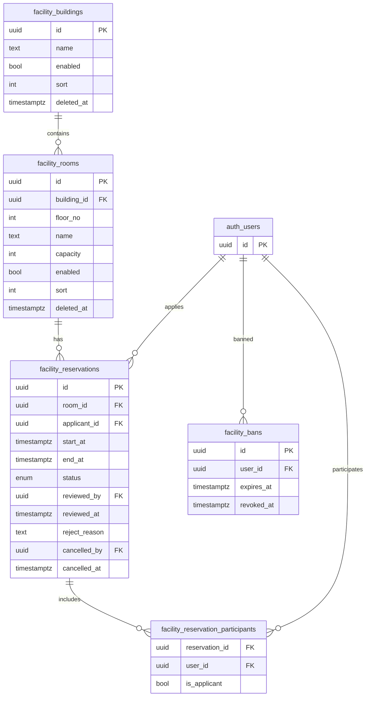
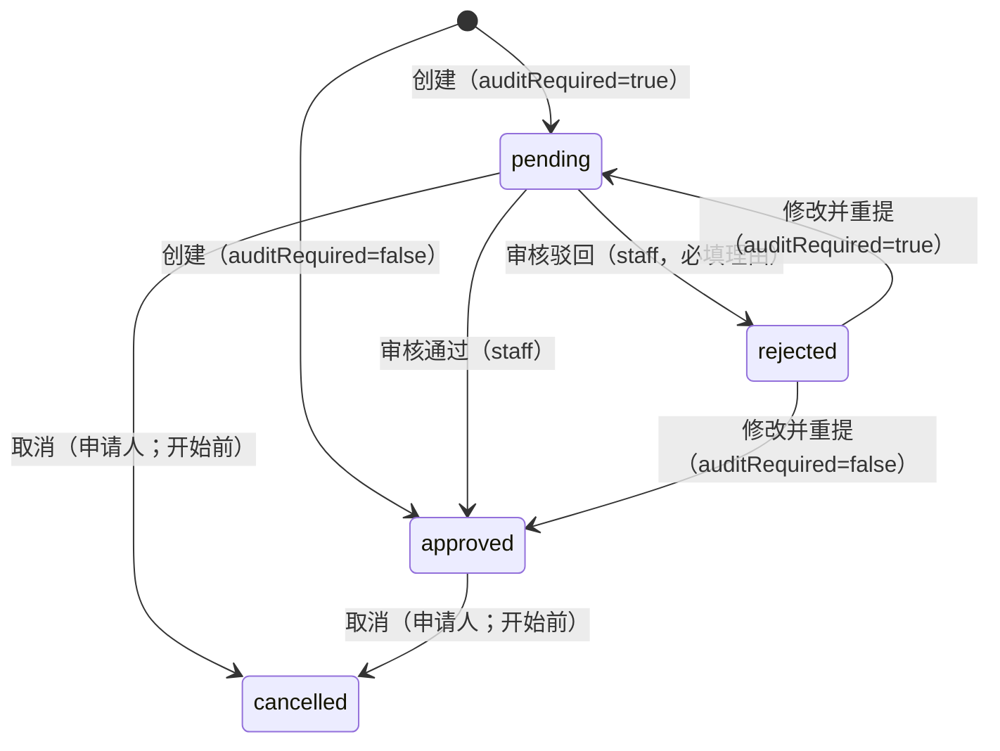

# 功能房预约模块报告（MVP）

**状态**：✅ 已交付（MVP）  
**版本**：v1.0  
**最近更新**：2025-12-19  

关联文档：
- 需求（冻结）：`docs/requirements/facility-reservation.md`
- API 契约：`docs/api/facility-reservation.md`

## 1. 模块概览

本模块提供“按楼房/楼层浏览功能房 → 查看占用时间轴 → 提交预约”的 Portal 闭环，并在 Console 提供管理能力：
- 楼房/房间基础管理（启用/停用、排序、备注）
- 预约审核（可开关，默认关闭）
- 模块级封禁（可到期/可永久；仅影响新建预约）
- 榜单（7d/30d，SQL 聚合）

关键约束（MVP）：
- 时间段：任意起止，可跨天；开始时间必须晚于当前时间；最长使用时长默认 72h（可配置）
- 参与人：至少 3 人（含申请人），且必须为系统内真实用户（`auth.users`/`profiles`）
- 冲突：同一房间在 `pending/approved` 状态下禁止时间段重叠

## 2. 领域模型（ER）

说明：
- 楼层不单独建表：使用 `facility_rooms.floor_no` 表示楼层（可为负数，表示地下）。
- 用户引用统一使用 Supabase Auth 的 `auth.users(id)`。

## 3. 状态机与流程

### 3.1 预约状态机

### 3.2 创建预约（核心流程）

- 校验：时间段合法、用途长度、参与人数量与合法性
- 封禁：若申请人存在有效封禁（未撤销、未过期），禁止新建
- 审核开关：读取 `app_config.facility.auditRequired` 决定初始状态
- 一致性：事务内对房间行加锁（`select ... for update`）后做重叠检测（`start < end2 AND end > start2`）

## 4. 权限与访问控制

Portal：
- 仅要求登录（`requireUser`），不强制权限码（后端仍进行数据一致性与状态校验）。

Console（后端强制校验，前端仅做入口隐藏增强 UX）：

| 能力 | Console 页面/接口 | 权限码 |
| --- | --- | --- |
| 楼房管理 | `/console/facilities/buildings`、`/api/console/facilities/buildings/**` | `campus:facility:*` |
| 房间管理 | `/console/facilities/rooms`、`/api/console/facilities/rooms/**` | `campus:facility:*` |
| 预约审核 | `/console/facilities/reservations`、`/api/console/facilities/reservations/**` | `campus:facility:review` |
| 模块封禁 | `/console/facilities/bans`、`/api/console/facilities/bans/**` | `campus:facility:ban` |
| 模块配置 | `/console/facilities/config`、`/api/console/facilities/config/**` | `campus:facility:config` |

角色约定（已在迁移中固化）：
- `staff`：仅绑定 `campus:facility:review`
- `admin`：绑定 `campus:facility:*`（不含基础设施相关权限）
- `super_admin`：绑定 `campus:*:*`（系统通配）

## 5. 配置项（app_config）

- `facility.auditRequired`：是否开启审核（默认 `false`）
- `facility.maxDurationHours`：单次预约最长时长（默认 `72`）

## 6. 一致性与性能策略

- 冲突校验使用“房间行锁 + 重叠查询”保证并发下的正确性（避免两次并发创建都通过校验）。
- 对 `pending/approved` 预约建立 partial index（优化时间轴与冲突查询）。
- 榜单采用 SQL 聚合（MVP 接受 SQL 计算成本，不引入缓存/队列）。

## 7. 已知限制与后续计划

- 楼层未单独建表：当前“楼房/楼层/房间”通过 `building + floorNo + room` 组合实现；如需整层启停/配置，可在后续引入 `facility_floors` 表或提供批量操作增强。
- 未实现开放时间/节假日策略、周期预约、通知推送、外部日历订阅（iCal）。
- 时间轴为自研组件（不引入额外依赖），后续可增强拖拽选择、区间缩放、密度自适应等交互。

## 8. 手工测试清单（验收用）

> 建议在 Supabase 中准备至少 3 个测试账号（1 个 `staff`、1 个 `admin`、1 个普通 `user`），并确保 `profiles` 中有姓名/学号用于搜索。

### 8.1 Console：空间管理

1. 楼房新增/编辑/停用
   - 操作：`admin/super_admin` 进入 `/console/facilities/buildings` 新增楼房，编辑名称/排序/备注，停用。
   - 期望：列表刷新正确；停用后 Portal 中该楼房/其房间不可用于新建预约（后端拒绝）。

2. 房间新增/编辑/停用
   - 操作：在 `/console/facilities/rooms` 新增房间，设置 `floorNo=-1/1`、容量、排序；停用房间。
   - 期望：按楼房/楼层筛选正常；停用后禁止新建预约。

### 8.2 Portal：时间轴与创建

3. 楼层纵览甘特图
   - 操作：访问 `/facilities`，选择楼房与楼层。
   - 期望：显示该楼层所有房间的时间轴；`approved` 实线、`pending` 虚线；跨天区间正常渲染。
   - 期望：窗口默认 7 天，可切换 5/7/30；刻度可切换 1/2/4/6 小时（默认 2h）。
   - 交互补充：拖拽空白区域可选择时间段（30min 吸附），松开后打开预约弹窗并预填开始/结束时间。
   - 交互补充：拖拽选区如与已有占用重叠，直接弹窗提示“已被预约/占用”，并拦截创建。
   - 交互补充：拖拽选区如超过最大可预约时长（`facility.maxDurationHours`），弹窗提示上限小时数，并拦截创建。
   - 交互补充：悬停显示指针时间；窗口内显示当前时间线（红线）。
   - 交互补充：拖拽过程中显示浮层（开始/结束/时长）；拖拽到左右边缘自动横向滚动（可选择更长区间）。

4. 创建预约（审核关闭）
   - 前置：`facility.auditRequired=false`
   - 操作：在纵览或房间页发起预约；选择开始/结束时间（可跨天）；选择参与人使总人数 ≥3。
   - 期望：创建后状态为 `approved`；“我的预约”可见；时间轴展示占用。

5. 冲突校验
   - 操作：对同一房间创建与现有 `pending/approved` 区间重叠的预约。
   - 期望：时间轴选区阶段前端直接弹窗拦截；提交时后端仍返回 409 并提示“时间段冲突，请查看时间轴并调整”（兜底）。

6. 参与人校验（必须是真实用户）
   - 操作：输入不存在的用户信息（仅前端搜索不到，不应能提交）。
   - 期望：无法选中不存在用户；后端对非法 userId 仍返回参数错误/不存在错误。

### 8.3 审核流（审核开启）

7. 创建预约进入待审
   - 前置：`facility.auditRequired=true`
   - 操作：创建预约。
   - 期望：状态为 `pending`；时间轴展示为虚线；`staff` 可在 Console 审核列表看到。

8. 审核通过/驳回
   - 操作：`staff` 在 `/console/facilities/reservations` 通过或驳回（驳回填写理由）。
   - 期望：通过后状态 `approved`；驳回后状态 `rejected`，Portal “我的预约”展示驳回理由。

9. 驳回后修改并重提
   - 操作：申请人在“我的预约”点击“修改并重提”，调整时间段/参与人/用途提交。
   - 期望：按审核开关变为 `pending/approved`；旧状态被更新；时间轴同步变化。

### 8.4 取消与封禁

10. 取消预约（开始前）
   - 操作：对 `pending/approved` 且开始时间晚于当前时间的预约执行取消。
   - 期望：取消成功；列表与时间轴不再展示该预约（时间轴默认不显示 `cancelled`）。

11. 取消预约（开始后，前端提示 + 后端兜底）
   - 操作：构造已开始的预约（或等待开始时间到达）后尝试取消。
   - 期望：前端“取消”按钮禁用并提示“已开始，无法取消”；若绕过前端调用，后端返回冲突错误。

12. 模块封禁（仅影响新建）
   - 操作：`admin/super_admin` 在 `/console/facilities/bans` 封禁某申请人（可选到期时间）。
   - 期望：被封禁者无法新建预约；历史预约不受影响；撤销封禁后恢复新建能力。

### 8.5 榜单

13. 榜单查询
   - 操作：访问 `/facilities/leaderboard`，切换 7d/30d。
   - 期望：房间榜/用户榜显示正确，时长与排序符合预期。
