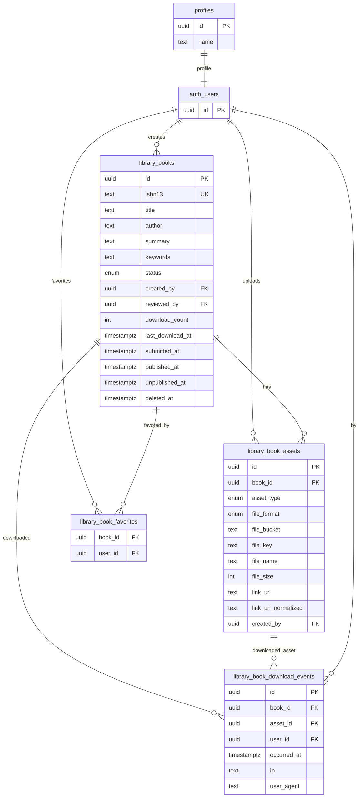
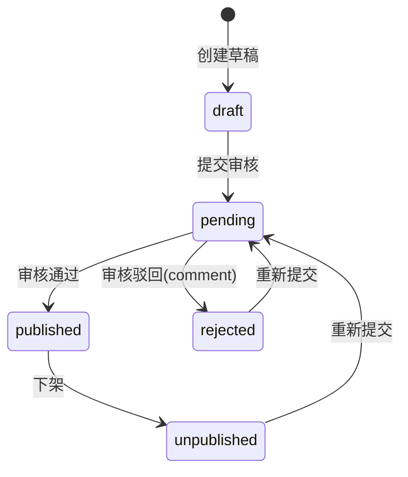

# 数字图书馆模块报告（MVP）

**状态**：✅ 已交付（MVP）  
**版本**：v1.0  
**最近更新**：2025-12-21  

关联文档：
- 需求（冻结）：`docs/requirements/library.md`
- API 契约：`docs/api/library.md`
- 运维（bucket）：`docs/ops/infra-bootstrap.md`

## 1. 模块概览

本模块提供“电子书/资料”的**下载型资源分享**能力（不做在线阅读/借阅）。内容供给由用户投稿驱动，馆员（`librarian`）审核发布，并提供收藏与榜单能力。

Portal（登录即可）：
- 列表：搜索（标题/作者/ISBN/关键词）、格式过滤（pdf/epub/mobi/zip）、排序（最新/下载）
- 详情：元数据展示、资产列表、按资产下载（文件/外链）
- 收藏：收藏/取消收藏、我的收藏
- 投稿：创建草稿、编辑元数据、上传文件/添加外链、提交审核
- 榜单：图书下载榜、用户贡献榜（总榜 + 7/30/365 days）

Console（按权限）：
- 审核：待审列表、通过/驳回（驳回需意见）、详情核验与“下载预览（不计数）”
- 运营：已发布下架、已驳回/已下架列表
- 清理：硬删除（仅 `admin/super_admin`，删库并尝试清理已上传对象）

关键约束（MVP 冻结）：
- ISBN：**ISBN-13 必填且全局唯一**（入库仅 13 位数字，校验位必须正确）
- 文件：`pdf/epub/mobi` + 可选 `zip`；单文件 ≤ **100MB**
- 状态机：`draft/pending/published/rejected/unpublished`；对外可见内容变更需重新走审核（通过 submit 流转）
- 检索：仅元数据检索（不做全文检索）
- 下载统计：Portal 下载写入事件表并冗余更新计数；Console 下载默认不计入榜单

## 2. 领域模型（ER）

说明：
- 用户引用统一使用 Supabase Auth 的 `auth.users(id)` 与 `public.profiles(id)`（用于展示作者信息）。
- 文件存储在 Supabase Storage（bucket=`library-books`，private），通过 BFF 生成签名上传/下载 URL。

## 3. 状态机与核心流程

### 3.1 图书状态机

### 3.2 投稿与审核（关键口径）

- 作者可编辑：`draft/rejected/unpublished`
- `pending`：作者不可修改（避免“提交后内容变化”导致审核不一致）
- `published`：作者不可直接修改；需先下架到 `unpublished` 再编辑并提交审核
- 任何“对外可见内容”的修改都必须重新走审核（通过 `submit` 回到 `pending`）

### 3.3 上传与下载（文件/外链）

上传（文件）：
1) Portal 创建草稿（获得 `bookId`）
2) 请求 BFF 生成 signed upload url（校验格式/文件名/size≤100MB）
3) 客户端直传 Storage（private bucket）
4) 提交审核（服务端要求至少存在 1 个资产）

下载（Portal）：
- 统一走 `POST /api/library/:id/download`：写入下载事件、冗余更新计数后 302 到 signed url 或外链

下载（Console）：
- `POST /api/console/library/books/:id/download` 仅用于审核预览（默认不计入榜单）

## 4. 权限与访问控制（RBAC）

Portal：
- 仅要求登录（`requireUser/requirePortalUser`），不要求权限码

Console：
- 入口与 API 统一按权限码控制（后端校验为唯一安全边界）

权限码（module=library）：
- `campus:library:*`：全量
- `campus:library:list`：管理端列表/查询
- `campus:library:read`：管理端详情查看（含预览下载）
- `campus:library:review`：审核通过/驳回
- `campus:library:offline`：下架
- `campus:library:delete`：硬删除（仅 admin/super_admin）

## 5. 存储与安全

- Storage bucket：`library-books`（private），单文件上限 **100MB**
- 上传：服务端生成 signed upload url，客户端直传（不暴露 service_role）
- 下载：服务端生成短时 signed url 并 302；外链同样通过 302 跳转并计数
- 外链：服务端规范化并在同一本书维度去重（`link_url_normalized` 唯一）
- RLS：library 相关表已启用 RLS；MVP 不下发策略，避免直连（BFF 为唯一入口）

## 6. 榜单与统计

- 图书下载榜：总榜或 `days=7|30|365` 窗口（基于 `library_book_download_events` 聚合）
- 用户贡献榜：总榜或 `days=7|30|365` 窗口（按 `published_at` 窗口统计发布数量）

## 7. 测试与验收

自动化测试：
- `lib/modules/library/library.utils.test.ts`：ISBN-13 规范化/校验位、文件格式与大小白名单、默认下载资产选择

推荐命令：
- `pnpm -C "campus-hub-next" lint`
- `pnpm -C "campus-hub-next" test`
- `pnpm -C "campus-hub-next" build`

手工验收（最小闭环）：
1) `/library/me?dialog=library-create` 创建草稿（创建后自动进入编辑弹窗）→ 上传文件/添加外链 → 提交审核
2) `/console/library/pending` 审核通过 → `/library` 可检索到 → 详情可下载
3) 下载一次 → `/library/leaderboard` 验证计数；收藏 → `/library/favorites` 验证列表

## 8. 已知限制与后续计划

已知限制（MVP）：
- 不做在线阅读/借阅/OPDS/全文检索
- 不做封面提取与文件元数据解析（仅存储用户提供的元数据）
- 不做复杂防刷与反作弊（榜单统计基于事件表，后续可加节流/去重策略）

后续计划（建议）：
- 封面图（手工上传 vs 从 PDF/EPUB 抽取）与列表卡片更强的视觉层级
- 更丰富的元数据（出版社/出版年/语言/版本/标签体系）与更合适的索引策略
- 更完善的风控（按 userId/ip/ua 的最小间隔、异常检测、下载事件聚合策略）
