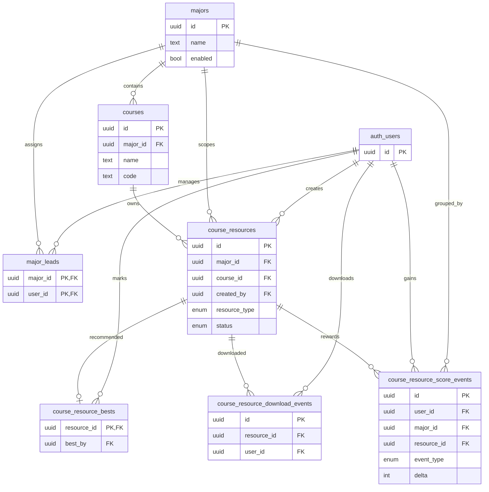

# 课程资源分享数据库设计报告

## 1. 模块定位

课程资源分享模块是本次课程设计中的第二个核心业务案例，用于展示“专业-课程-资源-审核-下载-推荐-积分”这一类内容平台业务如何通过关系数据库建模实现。

该模块的业务特点包括：

- 教学层级明确
- 多角色参与审核
- 资源具有状态流转
- 既有主体数据，也有事件事实数据
- 同时存在去重和统计需求

从数据库课程设计角度，它很适合用于讲解：

- 一对多与多对多关系
- 状态机建模
- 事件事实表设计
- 必要冗余与规范化之间的取舍

## 2. 概念结构设计

本模块的主要实体和联系如下：

- 专业 `majors`
- 专业负责人 `major_leads`
- 课程 `courses`
- 课程资源 `course_resources`
- 最佳推荐 `course_resource_bests`
- 下载事件 `course_resource_download_events`
- 积分事件 `course_resource_score_events`

对应概念总览图如下；如果需要更详细、分层的 E-R 图，请直接参考：

- `docs/report/overview/conceptual-structure-and-er.md`
  - `6.1 教学主数据层`
  - `6.2 资源主体与审核流`
  - `6.3 推荐、下载与积分事实层`

本节保留模块总览图如下：

## 3. 关系模式设计

主要关系模式可表示为：

- `MAJORS(id, name, enabled, sort, remark, created_at, updated_at, deleted_at)`
  - 主键：`id`
  - 候选键：`name` 在未删除记录范围内唯一
- `MAJOR_LEADS(major_id, user_id, created_at)`
  - 主键：`(major_id, user_id)`
  - 外键：
    - `major_id -> majors.id`
    - `user_id -> auth.users.id`
- `COURSES(id, major_id, name, code, enabled, sort, remark, created_at, updated_at, deleted_at)`
  - 主键：`id`
  - 外键：`major_id -> majors.id`
  - 候选键：`(major_id, name)` 在未删除记录范围内唯一
- `COURSE_RESOURCES(id, major_id, course_id, title, description, resource_type, status, file_bucket, file_key, file_name, file_size, sha256, link_url, link_url_normalized, submitted_at, reviewed_by, reviewed_at, review_comment, published_at, unpublished_at, download_count, last_download_at, created_by, updated_by, created_at, updated_at, deleted_at)`
  - 主键：`id`
  - 外键：
    - `major_id -> majors.id`
    - `(course_id, major_id) -> courses(id, major_id)`
    - `reviewed_by -> auth.users.id`
    - `created_by -> auth.users.id`
    - `updated_by -> auth.users.id`
- `COURSE_RESOURCE_BESTS(resource_id, best_by, best_at)`
  - 主键：`resource_id`
  - 外键：
    - `resource_id -> course_resources.id`
    - `best_by -> auth.users.id`
  - 关键约束：
    - 仅允许作用于 `published` 资源
- `COURSE_RESOURCE_DOWNLOAD_EVENTS(id, resource_id, user_id, occurred_at, ip, user_agent)`
  - 主键：`id`
  - 外键：
    - `resource_id -> course_resources.id`
    - `user_id -> auth.users.id`
- `COURSE_RESOURCE_SCORE_EVENTS(id, user_id, major_id, resource_id, event_type, delta, occurred_at)`
  - 主键：`id`
  - 外键：
    - `user_id -> auth.users.id`
    - `major_id -> majors.id`
    - `resource_id -> course_resources.id`
    - `(resource_id, major_id) -> course_resources(id, major_id)`
    - `(resource_id, user_id) -> course_resources(id, created_by)`
  - 候选键：
    - `(user_id, resource_id, event_type)` 通过唯一约束保证首次语义

## 4. 完整性设计

### 4.1 实体完整性

本模块所有主体对象都具有明确主键：

- `majors.id`
- `courses.id`
- `course_resources.id`
- `course_resource_download_events.id`
- `course_resource_score_events.id`

桥接关系 `major_leads` 使用复合主键 `(major_id, user_id)`，适合表达“一个专业可有多个负责人，一个用户可负责多个专业”的业务事实。

### 4.2 参照完整性

已在数据库层显式建立的重要物理外键包括：

- `courses.major_id -> majors.id`
- `major_leads.major_id -> majors.id`
- `major_leads.user_id -> auth.users.id`
- `course_resources.major_id -> majors.id`
- `course_resources(course_id, major_id) -> courses(id, major_id)`
- `course_resources.created_by -> auth.users.id`
- `course_resource_bests.resource_id -> course_resources.id`
- `course_resource_bests.best_by -> auth.users.id`
- `course_resource_download_events.resource_id -> course_resources.id`
- `course_resource_score_events.major_id -> majors.id`
- `course_resource_score_events.resource_id -> course_resources.id`
- `course_resource_score_events(resource_id, major_id) -> course_resources(id, major_id)`
- `course_resource_score_events(resource_id, user_id) -> course_resources(id, created_by)`

这些外键使教学层级、资源归属、作者归属和推荐归属都具有清晰的参照关系。

### 4.3 用户定义完整性

已在数据库层表达的重要规则包括：

- 资源下载计数必须非负
- 文件大小必须非负
- 文件型资源与外链型资源字段组合必须匹配
- 资源状态与 `submitted_at/reviewed_at/review_comment/published_at/unpublished_at` 的组合必须满足 `course_resources_status_consistency_chk`
- 同一课程下文件资源按 `sha256` 去重
- 同一课程下外链资源按规范化 URL 去重
- `course_resource_bests.best_by` 通过外键约束到 `auth.users.id`
- 最佳推荐只能作用于已发布资源，且资源下架后会自动撤销最佳标签
- 积分事件中的 `major_id` 必须与资源的 `major_id` 一致
- 积分事件中的 `user_id` 必须等于资源作者 `created_by`
- 积分事件 `delta > 0`
- 积分事件通过 `(user_id, resource_id, event_type)` 唯一约束保证首次语义

其中，`course_resources_file_or_link_chk` 是本模块最有代表性的数据库约束之一，它把“文件资源”和“外链资源”的字段互斥关系直接表达在数据库层。

## 5. 规范化分析

### 5.1 达到 3NF/BCNF 的部分

下列关系模式基本可视为达到 3NF，部分桥接表接近 BCNF：

- `majors`
- `major_leads`
- `courses`
- `course_resource_bests`
- `course_resource_download_events`

原因在于：

- 各表都围绕单一业务事实建模
- 多对多关系通过桥接表拆分
- 事件事实与主体事实分离

### 5.2 需要重点解释的“必要冗余”

#### `course_resources.major_id`

当前 `course_resources` 同时保存了：

- `course_id`
- `major_id`

而从教学层级关系看，存在：

- `course_id -> courses.major_id`

这意味着从严格范式角度看，`course_resources.major_id` 带有受控冗余性质，并不是最纯粹的 3NF 设计。

当前系统之所以保留它，主要是为了：

- 便于按专业做资源范围过滤
- 便于统计和排行查询
- 降低部分常用联表成本

但必须明确说明：

- 这不是“随便冗余”，而是有目的的受控冗余
- 当前一致性已经不仅依赖服务层，而是由 `(course_id, major_id) -> courses(id, major_id)` 这一复合外键锁定
- 服务层仍会做前置校验，但数据库已经成为最终一致性边界

#### `course_resource_score_events.major_id` 与 `user_id`

积分事件表同时保存了 `major_id` 与 `user_id`。它们本质上是为了：

- 方便按专业计算积分榜
- 保留事件发生时的分组维度
- 直接支持“作者积分”这一统计视角

这两个字段同样属于需要在答辩中主动解释的受控冗余，但它们现在已经分别由：

- `(resource_id, major_id) -> course_resources(id, major_id)`
- `(resource_id, user_id) -> course_resources(id, created_by)`

两组复合外键锁定，而不是停留在“主要靠服务层维护”。

### 5.3 当前范式层面的核心结论

因此，对本模块更准确的说法应当是：

- 专业、课程、负责人、下载事件等核心结构基本符合 3NF
- 资源主体表和积分事件表中存在面向查询与业务范围控制的受控冗余
- 这些冗余必须配套说明一致性保证机制，否则容易被老师质疑

## 6. 当前实现亮点

### 6.1 主体数据与事件数据分层明确

本模块没有把下载、积分等统计事实混进资源主体表，而是采用：

- `course_resources`
  - 表达资源当前状态
- `course_resource_download_events`
  - 表达下载事实
- `course_resource_score_events`
  - 表达积分事实

这很适合数据库课程设计中对“事实表”和“主数据表”的区分说明。

### 6.2 去重规则数据库化

当前去重规则已经不只是服务层判断，而是通过数据库唯一索引落地：

- 文件型资源：
  - `(course_id, sha256)` 唯一
- 外链型资源：
  - `(course_id, link_url_normalized)` 唯一

这属于老师通常比较认可的“数据库自己在发挥作用”的设计。

### 6.3 状态机、最佳推荐与作者归属数据库化

当前本模块又补齐了三类很关键的数据库规则：

- `course_resources_status_consistency_chk`
  - 保证资源状态与提交/审核/发布字段组合一致
- `course_resource_bests_best_by_fk` 与 `course_resource_bests_resource_published_chk`
  - 保证最佳推荐既有推荐人外键，也只能作用于已发布资源
- `course_resource_score_events_resource_major_fk` 与 `course_resource_score_events_resource_user_fk`
  - 保证积分事件中的专业维度和作者归属维度都与资源主体一致

### 6.4 首次积分语义数据库化

积分事件使用唯一约束 `(user_id, resource_id, event_type)`，从数据库层保证：

- 同一用户针对同一资源的同类积分不会重复发放

这非常适合作为答辩中的一个亮点说明。

## 7. 当前实现与真实剩余边界

### 7.1 已在数据库层完成

- 资源状态与时间字段一致性
- `best_by` 物理外键
- “最佳推荐仅限已发布资源”与下架自动撤销
- `course_resources.major_id` 与课程所属专业的一致性
- `course_resource_score_events.major_id/user_id` 与资源主体的一致性

### 7.2 仍需在答辩中重点解释的设计取舍

- `course_resources.major_id`
  - 这是为了查询、范围控制和统计而保留的受控冗余，但现在已由复合外键锁定一致性
- `course_resource_score_events.major_id` 与 `user_id`
  - 这是为了积分榜和作者维度统计保留的受控冗余，也已由复合外键锁定一致性
- `download_count` / `last_download_at`
  - 属于面向读性能的汇总冗余，答辩时应说明它们与下载事件事实表并存的原因是“查询效率优先”，而不是建模混乱

## 8. 老师视角答辩重点

本模块最适合这样讲：

- 专业、课程、资源、下载事件、积分事件表达的是不同层次的事实，因此必须分层建模
- 资源审核流和下载统计并不是简单页面逻辑，而是数据库状态和事实数据问题
- 去重、状态一致性、最佳推荐、首次积分都已经有数据库级约束支撑
- 必要冗余并没有放任不管，而是用复合外键锁住了专业维度和作者归属的一致性

如果这一点讲清楚，本模块会显得非常像一份认真做过数据库理论取舍、并真正把关键规则落到数据库层的课程设计。
