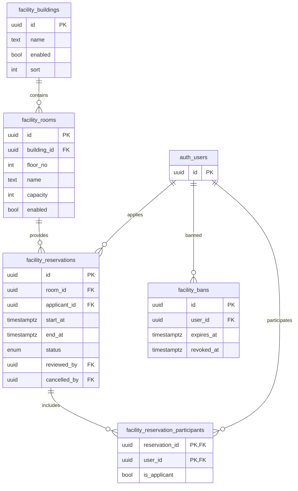

# 功能房预约数据库设计报告

## 1. 模块定位

功能房预约模块是本次课程设计中最典型的“时间资源管理”案例，主要解决以下问题：

- 楼房与房间基础数据管理
- 房间占用时间轴查询
- 预约申请、审核、驳回、取消
- 预约参与人管理
- 违规用户封禁
- 使用排行统计

从数据库课程设计角度，本模块的核心价值在于它同时具备：

- 明确的主从结构
- 显式的状态流转
- 明确的时间区间约束
- 典型的并发冲突问题

因此，这一模块非常适合作为答辩时重点讲解的业务案例。

## 2. 概念结构设计

本模块的主要实体和联系如下：

- 楼房 `facility_buildings`
- 房间 `facility_rooms`
- 预约 `facility_reservations`
- 预约参与人 `facility_reservation_participants`
- 封禁记录 `facility_bans`

对应概念总览图如下；如果需要更详细、分层的 E-R 图，请直接参考：

- `docs/report/overview/conceptual-structure-and-er.md`
  - `5.1 空间资源层`
  - `5.2 预约事务层`
  - `5.3 模块治理层`

本节保留模块总览图如下：

## 3. 关系模式设计

主要关系模式可表示为：

- `FACILITY_BUILDINGS(id, name, enabled, sort, remark, created_at, updated_at, deleted_at)`
  - 主键：`id`
  - 候选键：`name` 在未删除记录范围内唯一
- `FACILITY_ROOMS(id, building_id, floor_no, name, capacity, enabled, sort, remark, created_at, updated_at, deleted_at)`
  - 主键：`id`
  - 外键：`building_id -> facility_buildings.id`
  - 候选键：`(building_id, floor_no, name)` 在未删除记录范围内唯一
- `FACILITY_RESERVATIONS(id, room_id, applicant_id, purpose, start_at, end_at, status, reviewed_by, reviewed_at, reject_reason, cancelled_by, cancelled_at, cancel_reason, created_by, updated_by, created_at, updated_at)`
  - 主键：`id`
  - 外键：
    - `room_id -> facility_rooms.id`
    - `applicant_id -> auth.users.id`
    - `reviewed_by -> auth.users.id`
    - `cancelled_by -> auth.users.id`
    - `created_by -> auth.users.id`
    - `updated_by -> auth.users.id`
- `FACILITY_RESERVATION_PARTICIPANTS(reservation_id, user_id, is_applicant, created_at)`
  - 主键：`(reservation_id, user_id)`
  - 外键：
    - `reservation_id -> facility_reservations.id`
    - `user_id -> auth.users.id`
  - 关键约束：
    - `facility_reservation_participants_applicant_uq` 保证每个预约至多一个 `is_applicant = true`
    - 延迟约束触发器保证“至少 3 人 + 恰有一个申请人 + 申请人必须等于 `applicant_id`”
- `FACILITY_BANS(id, user_id, reason, expires_at, revoked_at, revoked_reason, created_by, revoked_by, created_at)`
  - 主键：`id`
  - 外键：
    - `user_id -> auth.users.id`
    - `created_by -> auth.users.id`
    - `revoked_by -> auth.users.id`

## 4. 完整性设计

### 4.1 实体完整性

本模块所有主体表均具有稳定主键：

- `facility_buildings.id`
- `facility_rooms.id`
- `facility_reservations.id`
- `facility_bans.id`

桥接表 `facility_reservation_participants` 使用复合主键 `(reservation_id, user_id)`，这对于表达“一个预约下同一用户只能出现一次”非常自然。

### 4.2 参照完整性

本模块在核心关系上采用了显式物理外键：

- 房间依附楼房
- 预约依附房间
- 预约申请人、审核人、取消人均引用用户
- 预约参与人依附预约和用户
- 封禁记录依附用户

删除策略也具有明确业务意义：

- `facility_rooms.building_id -> facility_buildings.id`
  - 使用 `RESTRICT`
  - 说明楼房不能在仍有房间时被直接删除
- `facility_reservations.room_id -> facility_rooms.id`
  - 使用 `RESTRICT`
  - 说明有预约历史的房间不应被随意物理删除
- `facility_reservation_participants.reservation_id -> facility_reservations.id`
  - 使用 `CASCADE`
  - 说明参与人记录依附于预约主体

### 4.3 用户定义完整性

数据库层当前已表达的重要规则包括：

- 房间容量合法：
  - `capacity >= 0`
- 时间区间合法：
  - `end_at > start_at`
- 活跃预约时间段不得重叠：
  - 通过 `facility_reservations_room_active_time_excl` 排斥约束，把同一房间 `pending/approved` 预约的时间冲突下沉到数据库层
- 审核状态与审核字段一致性：
  - `pending/approved/rejected/cancelled` 与 `reviewed_by`、`reviewed_at`、`reject_reason`、`cancelled_by`、`cancelled_at` 的组合关系通过 `facility_reservations_status_consistency_chk` 表达
- 同一预约最多一个申请人参与人记录：
  - 通过部分唯一索引 `facility_reservation_participants_applicant_uq`
- 申请人与参与人一致性、最少人数要求：
  - 通过延迟约束触发器 `facility_reservations_participant_consistency_trg` 与 `facility_reservation_participants_consistency_trg` 保证“至少 3 人 + 恰有一个申请人 + 与 `applicant_id` 一致”
- 同一用户最多一条未撤销封禁记录：
  - 通过部分唯一索引 `facility_bans_user_active_uq`

## 5. 规范化分析

### 5.1 达到 3NF/BCNF 的核心关系

下列表结构基本可视为达到 3NF：

- `facility_buildings`
- `facility_rooms`
- `facility_reservations`
- `facility_bans`

桥接表 `facility_reservation_participants` 可视为接近 BCNF，因为其非主属性 `is_applicant` 直接依赖于复合主键所表示的联系事实。

### 5.2 规范化方面的优点

- 楼房与房间分表，避免在预约表中重复存储空间元数据
- 预约参与人独立建表，避免在预约主表中使用字符串列表
- 封禁记录独立建表，避免把封禁状态和封禁历史混入用户主表

这使得本模块的关系模式总体上比较清晰，便于用数据库理论解释。

## 6. 当前实现亮点

### 6.1 时间冲突与状态一致性已落库

`facility_reservations` 现在已经不是“只有服务层判断”的状态，而是同时具备：

- `facility_reservations_room_active_time_excl`
  - 保证同一房间的 `pending/approved` 预约时间段不可重叠
- `facility_reservations_status_consistency_chk`
  - 保证 `pending/approved/rejected/cancelled` 与审核/取消字段的组合可解释

这已经明显优于“完全只靠后端 `if` 判断”的实现方式。

### 6.2 物理设计与并发控制协同

当前迁移中已经建立：

- `facility_reservations(room_id, start_at, end_at)`
- 针对 `pending/approved` 的部分索引

服务层仍会在事务中对目标房间执行 `FOR UPDATE` 并做业务查询，但它现在承担的是“更友好的前置判断和业务流程控制”，数据库排斥约束才是并发写入下的最终硬保护。

### 6.3 申请人与参与人一致性已数据库化

当前数据库已经不只保证“最多一个申请人参与人记录”，还通过延迟约束触发器统一保证：

- 至少 3 名参与人
- 恰有 1 条 `is_applicant = true` 记录
- 该记录的 `user_id` 必须等于 `facility_reservations.applicant_id`

这类跨表、跨多行的业务规则由延迟约束触发器负责，比单纯停留在服务层校验更符合数据库课程设计的目标。

## 7. 当前实现与真实剩余边界

### 7.1 已明确在数据库层完成

- 活跃预约时间冲突
- 审核/驳回/取消状态一致性
- 申请人与参与人一致性
- 参与人数下限
- 参与人与预约主体的显式外键

### 7.2 封禁唯一索引与“自然过期”语义仍有细节

当前唯一索引只依据 `revoked_at is null` 判断“活动封禁”。这意味着：

- 一条已自然过期但未显式撤销的封禁记录，仍会占用唯一索引位置

工程上问题不大，但在课程设计答辩中最好主动说明这一点，并给出后续优化方向。

## 8. 老师视角答辩重点

本模块最适合这样讲：

- 楼房、房间、预约、参与人、封禁是五类不同事实，必须分表建模
- 时间冲突不是页面问题，而是数据库一致性问题
- 当前已经有外键、`CHECK`、部分索引、`EXCLUDE` 排斥约束、延迟约束触发器和事务控制
- 服务层事务与数据库硬约束是协同关系，而不是由服务层单独兜底
- 真正还可以保留为边界的问题，是 `facility_bans` 的“自然过期但未撤销”语义

也就是说，这一模块已经可以作为“复杂业务规则落到数据库层”的答辩主案例，而不是只展示一个还没落库的半成品。
