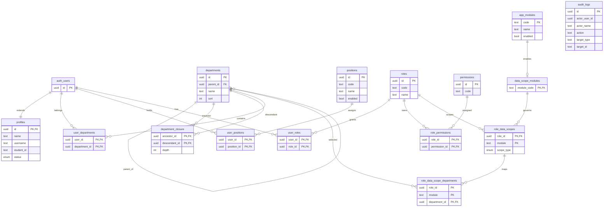

# 平台基础数据库设计报告

## 1. 模块定位

平台基础子系统是“校园生活平台”数据库课程设计的公共底座，用于解决以下五类核心问题：

- 用户身份与业务资料分离
- 组织结构与部门树建模
- 基于角色的访问控制
- 数据范围控制
- 管理端审计追踪

从数据库课程设计角度看，这一模块的重要性不仅在于“为其他模块提供公共能力”，更在于它本身就具备较强的数据库建模价值，能够较集中地展示：

- 一对一关系
- 多对多关系拆分
- 层级关系建模
- 复合主键与复合外键
- 触发器与约束函数
- 审计历史表设计

## 2. 概念结构设计

平台基础模块的主要实体和联系如下：

- 用户身份 `auth.users`
- 用户资料 `profiles`
- 部门 `departments`
- 部门闭包表 `department_closure`
- 用户-部门 `user_departments`
- 岗位 `positions`
- 用户-岗位 `user_positions`
- 角色 `roles`
- 权限 `permissions`
- 模块字典 `app_modules`
- 数据权限模块能力表 `data_scope_modules`
- 用户-角色 `user_roles`
- 角色-权限 `role_permissions`
- 角色数据范围 `role_data_scopes`
- 数据范围部门映射 `role_data_scope_departments`
- 审计日志 `audit_logs`

对应概念总览图如下；如果需要更详细、分层的 E-R 图，请直接参考：

- `docs/report/overview/conceptual-structure-and-er.md`
  - `4.1 身份、资料与组织结构`
  - `4.2 RBAC 与数据范围配置`
  - `4.3 审计与平台配置支撑结构`

本节保留模块总览图如下：

## 3. 关系模式设计

采用关系模式记号可表示为：

- `PROFILES(id, name, username, student_id, avatar_url, status, last_login_at, created_at, updated_at)`
  - 主键：`id`
  - 外键：`id -> auth.users.id`
- `DEPARTMENTS(id, name, parent_id, sort, created_at, updated_at)`
  - 主键：`id`
  - 外键：`parent_id -> departments.id`
- `DEPARTMENT_CLOSURE(ancestor_id, descendant_id, depth)`
  - 主键：`(ancestor_id, descendant_id)`
  - 外键：
    - `ancestor_id -> departments.id`
    - `descendant_id -> departments.id`
- `POSITIONS(id, code, name, description, enabled, sort, created_at, updated_at)`
  - 主键：`id`
- `USER_DEPARTMENTS(user_id, department_id, created_at)`
  - 主键：`(user_id, department_id)`
  - 外键：
    - `user_id -> auth.users.id`
    - `department_id -> departments.id`
- `USER_POSITIONS(user_id, position_id, created_at)`
  - 主键：`(user_id, position_id)`
  - 外键：
    - `user_id -> auth.users.id`
    - `position_id -> positions.id`
- `ROLES(id, code, name, description, created_at, updated_at)`
  - 主键：`id`
  - 候选键：`code`
- `PERMISSIONS(id, code, description, created_at)`
  - 主键：`id`
  - 候选键：`code`
- `APP_MODULES(code, name, enabled, sort, remark, created_at, updated_at)`
  - 主键：`code`
  - 候选键：`name`
- `DATA_SCOPE_MODULES(module_code, created_at)`
  - 主键：`module_code`
  - 外键：`module_code -> app_modules.code`
- `USER_ROLES(user_id, role_id, created_at)`
  - 主键：`(user_id, role_id)`
  - 外键：
    - `user_id -> auth.users.id`
    - `role_id -> roles.id`
- `ROLE_PERMISSIONS(role_id, permission_id, created_at)`
  - 主键：`(role_id, permission_id)`
  - 外键：
    - `role_id -> roles.id`
    - `permission_id -> permissions.id`
- `ROLE_DATA_SCOPES(role_id, module, scope_type, created_at, updated_at)`
  - 主键：`(role_id, module)`
  - 外键：
    - `role_id -> roles.id`
    - `module -> data_scope_modules.module_code`
- `ROLE_DATA_SCOPE_DEPARTMENTS(role_id, module, department_id, created_at)`
  - 主键：`(role_id, module, department_id)`
  - 外键：
    - `(role_id, module) -> role_data_scopes(role_id, module)`
    - `department_id -> departments.id`
- `AUDIT_LOGS(id, occurred_at, actor_user_id, actor_name, actor_email, actor_roles, action, target_type, target_id, success, error_code, reason, diff, request_id, ip, user_agent)`
  - 主键：`id`

## 4. 完整性设计

### 4.1 实体完整性

平台基础模块的核心表均具有明确主键：

- 单属性主键：
  - `profiles.id`
  - `departments.id`
  - `positions.id`
  - `roles.id`
  - `permissions.id`
  - `app_modules.code`
  - `data_scope_modules.module_code`
  - `audit_logs.id`
- 复合主键：
  - `department_closure(ancestor_id, descendant_id)`
  - `user_departments(user_id, department_id)`
  - `user_positions(user_id, position_id)`
  - `user_roles(user_id, role_id)`
  - `role_permissions(role_id, permission_id)`
  - `role_data_scopes(role_id, module)`
  - `role_data_scope_departments(role_id, module, department_id)`

这些主键都较稳定，能够满足数据库课程设计对实体完整性的要求。

### 4.2 参照完整性

本模块在核心关系上大量采用了显式物理外键：

- `profiles.id -> auth.users.id`
- `departments.parent_id -> departments.id`
- `department_closure.* -> departments.id`
- `user_departments.user_id -> auth.users.id`
- `user_departments.department_id -> departments.id`
- `user_positions.user_id -> auth.users.id`
- `user_positions.position_id -> positions.id`
- `user_roles.user_id -> auth.users.id`
- `user_roles.role_id -> roles.id`
- `role_permissions.role_id -> roles.id`
- `role_permissions.permission_id -> permissions.id`
- `data_scope_modules.module_code -> app_modules.code`
- `role_data_scopes.role_id -> roles.id`
- `role_data_scopes.module -> data_scope_modules.module_code`
- `role_data_scope_departments(role_id, module) -> role_data_scopes(role_id, module)`
- `role_data_scope_departments.department_id -> departments.id`

删除策略也有明确业务含义：

- `CASCADE`
  - 用于桥接表和闭包表等“依附型数据”
- `RESTRICT`
  - 用于用户部门归属等不允许直接破坏引用关系的数据
- `SET NULL`
  - 用于配置更新人等允许保留历史记录的数据

### 4.3 用户定义完整性

已在数据库层表达的重要规则包括：

- `profiles.student_id` 格式检查：
  - 通过 `CHECK` 约束限定为 16 位数字
- `profiles.username`、`profiles.student_id`
  - 通过唯一索引保证唯一性
- `roles.code`、`permissions.code`、`positions.code`
  - 通过唯一索引保证编码稳定
- `app_modules.code`
  - 通过 `CHECK` 约束限定为小写模块编码，并通过唯一索引保证模块名称稳定
- `role_data_scopes.module`
  - 通过 `data_scope_modules` 能力表外键约束，只允许登记“支持数据权限”的模块
- `department_closure.depth >= 0`
  - 通过 `CHECK` 约束保证层级深度合法
- 部门树防环
  - 通过触发器和函数阻止部门移动到自身子树下
- 审计日志 append-only
  - 通过触发器禁止 `UPDATE` 和 `DELETE`
- `audit_logs.actor_roles`
  - 通过 `CHECK` 约束要求快照结构为对象，若包含 `roleCodes` 则必须为数组

## 5. 规范化分析

### 5.1 达到 3NF/BCNF 的核心关系

下列表结构基本可以视为满足 3NF，很多桥接表甚至可视为达到 BCNF：

- `profiles`
- `roles`
- `permissions`
- `app_modules`
- `data_scope_modules`
- `positions`
- `user_departments`
- `user_positions`
- `user_roles`
- `role_permissions`
- `role_data_scopes`
- `role_data_scope_departments`

原因在于：

- 主体表中的非主属性直接依赖于主键
- 多对多关系被拆分为独立联系表
- 没有明显的部分依赖和传递依赖

### 5.2 需要特别解释的表

#### `department_closure`

`department_closure` 不是普通业务冗余，而是为高效表达“祖先-后代可达关系”而引入的派生关系表。它的存在是为了支撑：

- 部门及子部门查询
- 数据范围计算
- 层级管理场景

答辩时应强调：

- 这类表属于“为层级查询服务的数据库设计优化”
- 不应简单视为违背规范化的坏冗余

#### `audit_logs`

`audit_logs` 中的 `actor_name`、`actor_email`、`actor_roles` 属于审计快照字段，目的是保留操作发生时的历史语义，而不是依赖当前用户表回查。这类字段属于“历史真实性优先”的有意快照冗余。

从课程设计角度，应说明：

- 审计表与主数据表的设计目标不同
- 审计快照不是普通业务主数据中的随意冗余

### 5.3 当前仍需主动解释的设计取舍

- `role_data_scopes.module`
  - 已经不再是自由文本，而是经 `app_modules + data_scope_modules` 两层结构约束后的受控域
- `audit_logs.actor_user_id`
  - 仍然没有显式外键，但这是“保留历史审计事实优先”的有意弱引用，而不是遗漏
- `app_config` 采用 `key + jsonb` 的工程化配置结构
  - 实用性较强，但不适合作为关系建模亮点

## 6. 数据库对象与实现亮点

从数据库课程设计角度，本模块当前已有几个很能加分的实现点：

### 6.1 闭包表与触发器维护

- 通过 `department_closure` 表表达层级可达关系
- 通过触发器维护新增和父节点变更后的闭包关系
- 通过额外触发器阻止环路

这属于较强的数据库对象使用能力展示点。

### 6.2 模块字典与能力表分层

`app_modules` 记录“系统认可的模块主数据”，`data_scope_modules` 再从中筛出“允许配置数据权限”的模块能力集合。这样做的好处是：

- 模块集合本身可扩展
- “支持数据权限”不再靠业务代码约定，而是单独建模
- `role_data_scopes.module` 能直接受外键保护

### 6.3 复合外键

`role_data_scope_departments` 对 `(role_id, module)` 使用复合外键引用 `role_data_scopes`，这一点非常符合数据库课程设计中“联系必须有明确参照约束”的要求。

### 6.4 审计日志不可修改与弱引用快照

`audit_logs` 通过触发器实现 append-only，并新增 `actor_name` 快照与 `actor_roles` JSON 结构检查，这能很好体现：

- 历史追踪
- 数据库约束
- 数据治理意识

## 7. 当前实现与后续加强的边界

### 7.1 已明确在数据库层完成

- 主要桥接关系的物理外键
- 部门树防环与闭包维护
- 角色权限多对多关系
- 模块字典与数据权限能力表
- 数据范围的复合外键与模块域约束
- 审计日志 append-only 与弱引用快照

### 7.2 仍可进一步学院化强化

- 在答辩中说明 `audit_logs.actor_user_id` 为何保留弱引用，而不改成普通业务外键
- 对配置表进行“关系化拆分”或至少在报告中主动弱化其表现

## 8. 老师视角答辩重点

如果从老师视角来讲，本模块最值得优先展示的是：

- 组织树不是简单递归，而是闭包表建模
- 用户、角色、权限、部门、岗位之间的多对多关系拆分清晰
- 数据范围不是口头概念，而是有模块字典、能力表、关系表和复合外键
- 审计日志不是普通日志打印，而是数据库层的追加式历史表，并明确了弱引用快照策略

这部分整体上是当前项目中最接近“优秀数据库课程设计表达”的模块之一。
