# 校园生活平台概念结构设计与分层 ER 图

## 1. 编写目的

本文件用于支撑课程设计报告中的“概念结构设计”章节。

考虑到当前课题包含平台基础、功能房预约、课程资源分享三个主线模块，如果把全部实体和联系硬塞进一张图，会出现以下问题：

- 实体数量过多，可读性迅速下降
- 不同层次的关系混在一起，重点不突出
- 老师在阅读时难以快速看出“这一张图到底想说明什么”

因此，本文采用“先总览分层、再按模块拆图”的方式组织 E-R 图。

## 2. 绘图原则

为保证图示既适合报告排版，也适合答辩展示，本文遵循以下原则：

1. 不追求“一图画全”，而是按业务层次拆成多张小图。
2. 每张图只保留当前主题最关键的实体、主键、外键和识别性属性。
3. 桥接表、闭包表、事件事实表单独绘制，不把它们隐藏在文字里。
4. 对当前故意不建立物理外键、但存在业务联系的字段，在图外单独说明，避免误导。
5. 图的顺序按“总体分层 -> 模块主数据 -> 模块事务/事件”展开，使老师能顺着讲解逻辑阅读。

## 3. 总体分层视图

下面这张图不承担细节表达，而只说明本次数据库课程设计的四个结构层次：

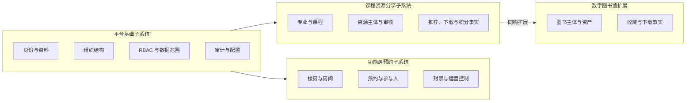

说明：

- 平台基础子系统是其他模块的公共底座
- 功能房预约与课程资源分享是本次课程设计的两个核心业务案例
- 数字图书馆可视为“与课程资源相近的下载型内容业务扩展”

## 4. 平台基础子系统 ER 图

### 4.1 身份、资料与组织结构

这一张图只关注“人从哪里来、属于哪些部门、担任哪些岗位、部门之间如何形成层级结构”。

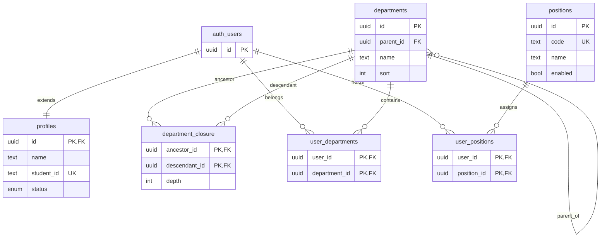

图示重点：

- `profiles` 与 `auth.users` 是一对一扩展关系
- `departments` 既有自引用父子关系，也有 `department_closure` 闭包表
- 用户与部门、岗位都是多对多关系，因此使用桥接表拆分

### 4.2 RBAC 与数据范围配置

这一张图只关注“用户拥有哪些角色、角色拥有哪些权限、角色在某模块上拥有哪些数据范围配置”。

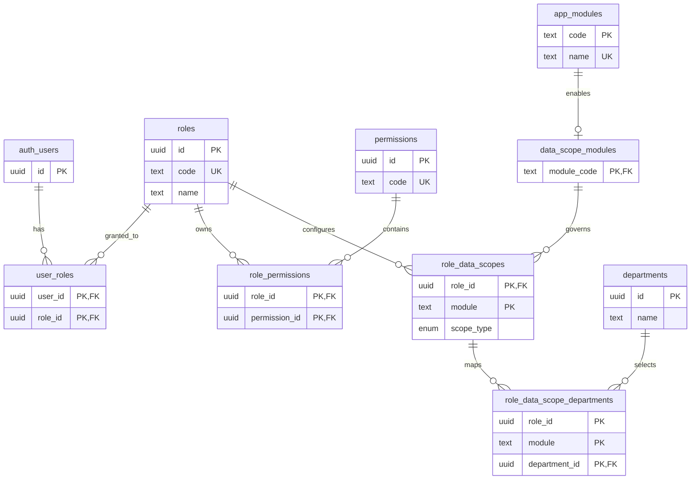

图示重点：

- `user_roles` 和 `role_permissions` 是标准 RBAC 桥接关系
- `app_modules` 与 `data_scope_modules` 把“模块主数据”与“支持数据权限的模块集合”拆开建模
- `role_data_scopes` 以 `(role_id, module)` 为识别键
- `role_data_scope_departments` 是以复合外键依附于 `role_data_scopes` 的子关系

### 4.3 审计与平台配置支撑结构

这一张图只关注平台级支撑数据，不与前两张图混在一起。

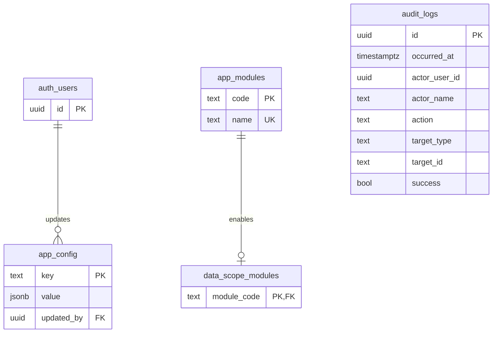

说明：

- `app_config.updated_by` 与用户存在物理外键关系
- `audit_logs.actor_user_id` 在业务上表示操作者，但当前数据库故意未建立物理外键
- `audit_logs.actor_name`、`actor_email`、`actor_roles` 用于保留事件发生时的身份快照
- 因此图中不把 `audit_logs` 画成与 `auth_users` 的硬连接，避免把“业务关联”误写成“数据库已强约束”

## 5. 功能房预约子系统 ER 图

### 5.1 空间资源层

这一张图只说明“楼房和房间”的空间主数据结构。

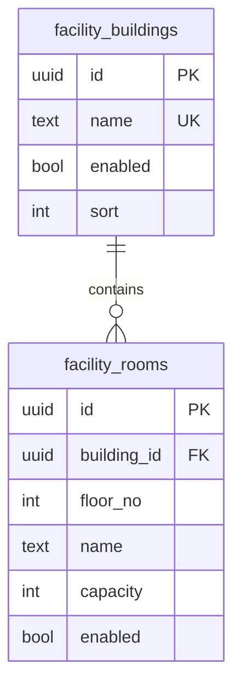

图示重点：

- 房间从属于楼房
- 房间的业务唯一性不是全局名称唯一，而是 `(building_id, floor_no, name)` 范围内唯一

### 5.2 预约事务层

这一张图展示功能房模块最核心的事务性结构：预约主体、申请人、参与人和房间之间的关系。

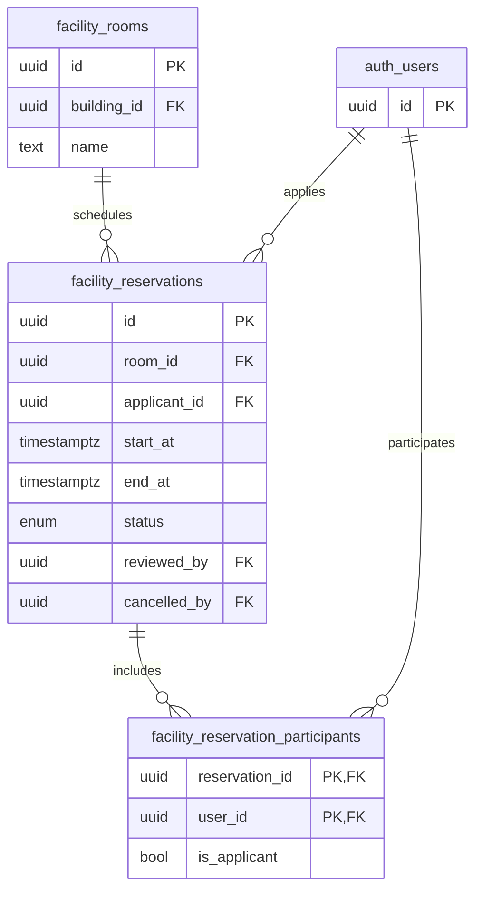

图示重点：

- `facility_reservations` 是事务主表
- `facility_reservation_participants` 是参与人桥接表
- 申请人既体现在主表 `applicant_id` 中，也会在参与人表中以 `is_applicant=true` 的方式出现
- 当前数据库还通过延迟约束触发器保证“至少 3 名参与人 + 恰有一个申请人 + 与 `applicant_id` 一致”

### 5.3 模块治理层

这一张图单独说明“封禁”这一治理结构，避免把它和预约事务主链混在一起。

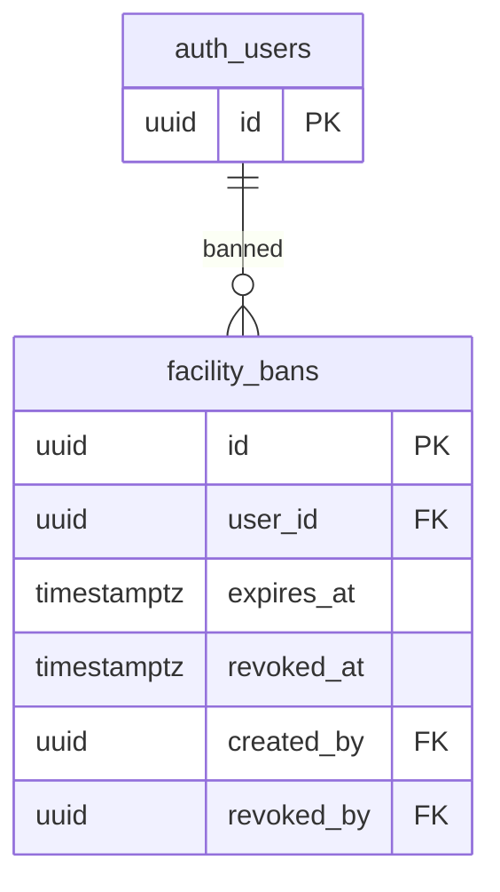

说明：

- `facility_bans` 负责管理“模块访问限制”，而不是预约过程本身
- 它与预约表分离，可以更清楚地表达“主体行为记录”和“治理措施记录”的差别

## 6. 课程资源分享子系统 ER 图

### 6.1 教学主数据层

这一张图说明专业、课程、专业负责人之间的教学层级关系。

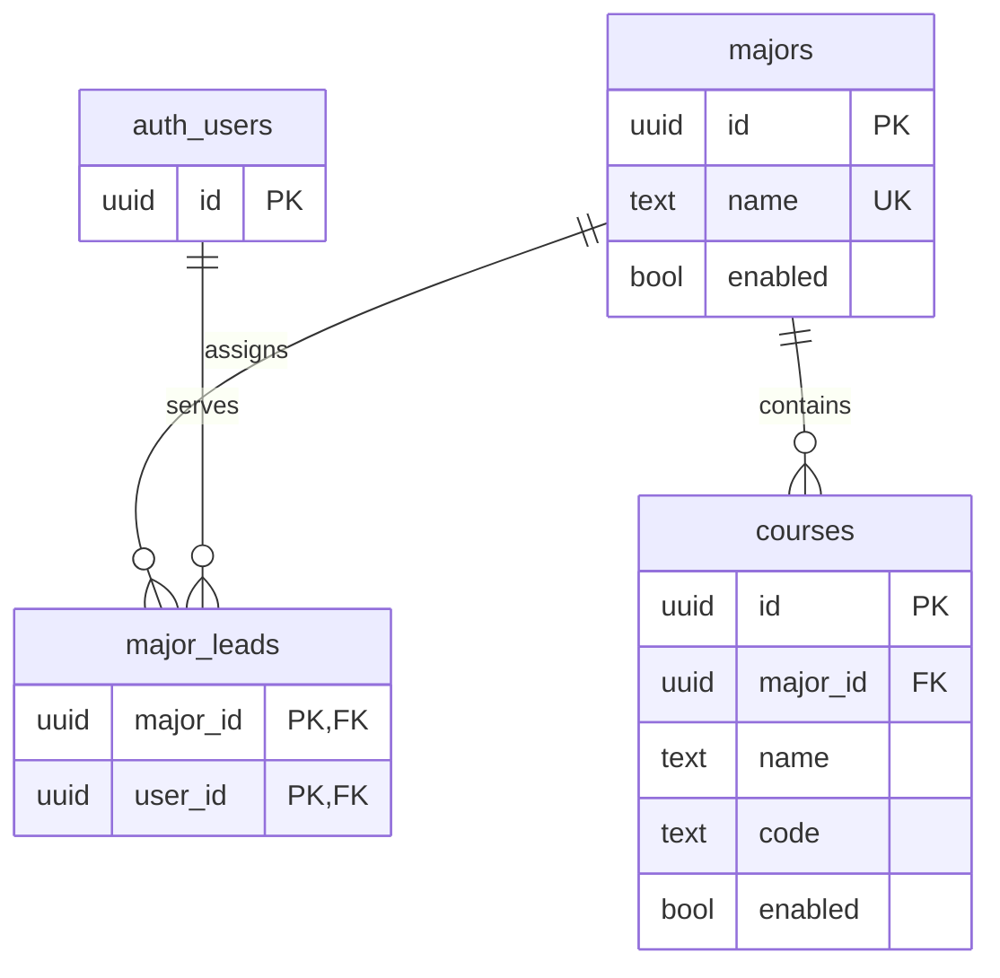

图示重点：

- `majors -> courses` 形成清晰的教学主数据层次
- `major_leads` 是负责人桥接关系，不把负责人字段直接塞进 `majors`

### 6.2 资源主体与审核流

这一张图展示课程资源主体如何依附于专业、课程和用户。

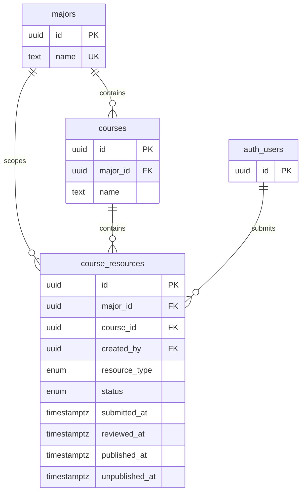

图示重点：

- `course_resources` 同时连接 `major_id` 和 `course_id`
- 从数据库理论角度看，这里存在需要主动解释的“受控冗余”
- 但这一受控冗余现在已经由 `(course_id, major_id)` 复合外键锁定一致性
- 该图正好适合答辩时引出“规范化与必要冗余之间的权衡”

### 6.3 推荐、下载与积分事实层

这一张图专门展示资源发布后的事实记录层，而不再与主数据层混画。

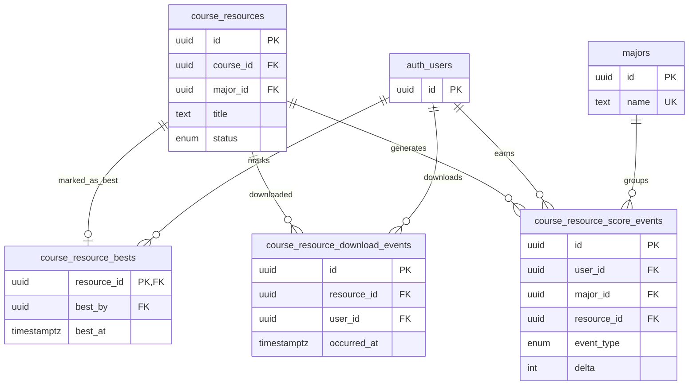

说明：

- `course_resource_bests.resource_id` 已有物理外键，因此画出与资源的一对一事实关系
- `course_resource_bests.best_by` 现在已经建立到 `auth.users.id` 的物理外键，因此画出与用户的硬连接
- `course_resource_score_events` 还通过复合外键与资源主体锁定了“专业维度一致性”和“作者归属一致性”
- 下载事件和积分事件都是事实表，它们与资源主表分离是本模块的重要设计亮点

## 7. 数字图书馆扩展 ER 图

数字图书馆是可选扩展，但它与课程资源模块在“下载型内容平台”建模上具有明显同构性，因此适合作为扩展案例。

### 7.1 图书主体与资产结构

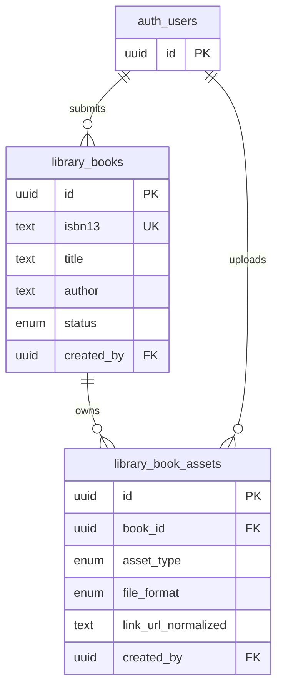

图示重点：

- 图书主体与资产拆表，避免在主表中堆叠多格式文件字段
- “一本书可对应多个资产”这一建模方式，比单文件图书表更适合数据库课程设计表达

### 7.2 收藏与下载事实层

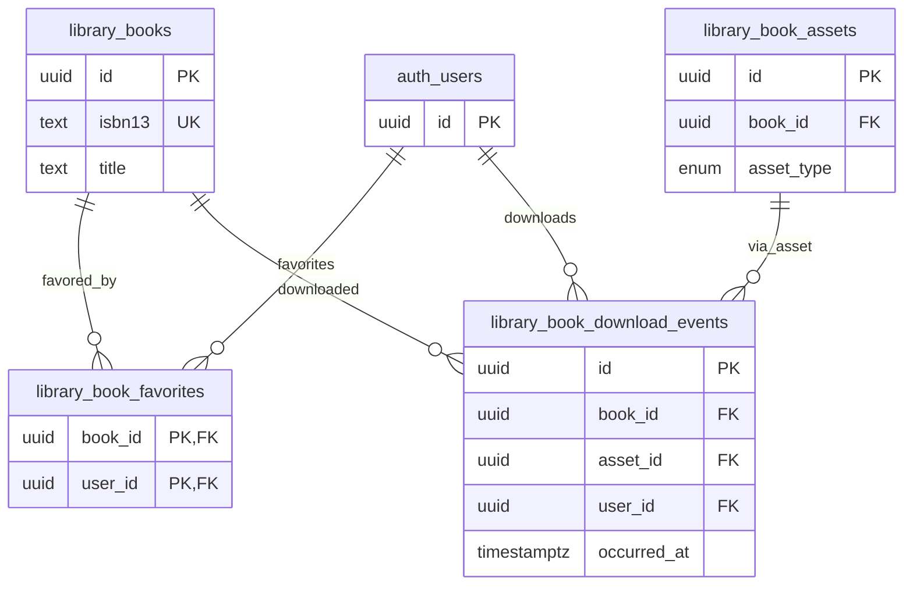

## 8. 报告与答辩中的使用建议

若要把这些图真正用在课程设计报告和答辩中，建议采用下面的展示顺序：

1. 先展示“总体分层视图”，让老师知道本次设计并不是杂糅的一堆功能。
2. 平台基础优先讲 `4.1` 和 `4.2`，突出组织树、RBAC、数据范围这些数据库味最强的部分。
3. 功能房预约重点讲 `5.2`，突出时间冲突排斥约束、延迟约束触发器和事务协同。
4. 课程资源重点讲 `6.2` 和 `6.3`，突出受控冗余、复合外键锁定一致性、事件事实表与首次积分语义。
5. 数字图书馆只作为“模型可复用的扩展案例”简要补充，不抢主线。

这样讲，老师更容易看到你是在“用数据库建模复杂业务”，而不是只做了几个页面。
