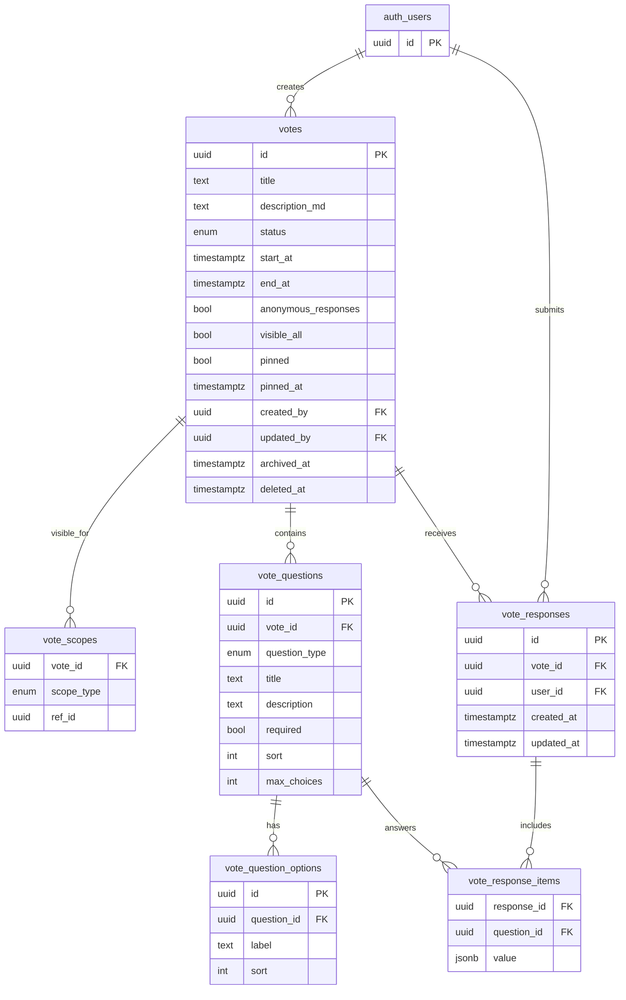
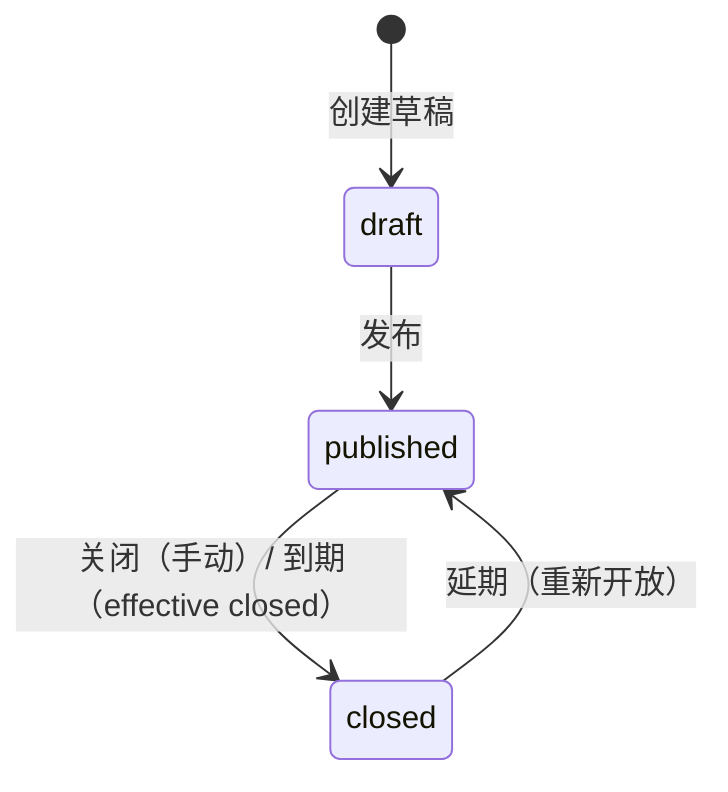

# 投票模块报告（MVP）

**状态**：✅ Done（已实现 + 已手工验收）  
**版本**：v1.0  
**最近更新**：2025-12-22  

关联文档：
- 需求（冻结）：`docs/requirements/votes.md`
- API 契约：`docs/api/votes.md`

## 1. 模块概览

本模块提供“多题投票（单选/多选）”能力，面向学生端（Portal）提供参与与结果查看闭环，并在管理端（Console）提供创建、发布与运营能力。

Portal（登录即可）：
- 公共列表：按可见范围展示，标记“已投/未投”，归档投票从公共列表隐藏
- 我的投票：仅展示我已参与的投票（包含归档）
- 详情：按规则提交/覆盖提交；结束或归档后查看结果

Console（按权限）：
- 草稿创建与编辑（投票说明、可见范围、题目/选项结构）
- 发布/关闭/延期（可到期后延期；关闭后延期会重新开放）
- 置顶/取消置顶（仅发布中可置顶；到期自动取消置顶）
- 归档（结束后归档；归档后只读，Portal 公共列表隐藏）

关键口径（MVP 冻结）：
- 多题：题型仅 `single|multi`；多选支持 `maxChoices`
- 截止前允许覆盖提交：同一用户对同一投票只保留**最新提交**
- 结果可见：仅在投票“有效结束（closed）”或“已归档”后可见；若延期重新开放，结果再次隐藏
- 匿名：仍要求登录并写入 `userId` 防重复；匿名仅影响未来“管理端导出/公示是否展示身份”（MVP 不提供实名名单/导出）
- 可见范围：`visibleAll=true` 或 `scopes(role/department/position)` 命中；部门命中包含子部门（口径与问卷/公告一致）

## 2. 领域模型（ER）

说明：
- 用户引用统一使用 Supabase Auth：`auth.users(id)`
- 题目答案使用 `jsonb` 存储（单选 `optionId` / 多选 `optionIds[]`），便于覆盖提交时原子替换

## 3. 状态机与核心流程

### 3.1 状态机

补充约束：
- `archivedAt != null` 表示“归档”：只读、不可延期/置顶/提交（不作为 `status` 的分支）
- `effectiveStatus`：当 `status=published` 且 `now>=endAt` 时视作 `closed`（结果可见、禁止提交）

### 3.2 覆盖提交（核心一致性）

- 数据库约束：`vote_responses(vote_id, user_id)` 唯一
- 提交策略：对 `vote_responses` 做 upsert，并在同一事务内用 `vote_response_items` 覆盖同一 `response_id` 下的所有题目答案（只保留最新一次提交）

### 3.3 可见性与结果可见

Portal 详情可见规则（任一满足即可）：
- 可见范围命中（`visibleAll=true` 或 scopes 命中）
- 我是创建者
- 我已参与（便于“后来被移出范围”的参与者仍可回看）

结果可见规则：
- `effectiveStatus=closed` 或 `archivedAt!=null`
- 若投票延期（closed → published），结果再次隐藏，直至再次结束/归档

## 4. 权限与访问控制（RBAC + DataScope）

Portal：
- 仅要求登录（`requireUser`），不要求权限码

Console：
- 入口与 API 统一按权限码控制（后端校验为唯一安全边界）

权限码（module=vote）：
- `campus:vote:*`：全量
- `campus:vote:list`：管理端列表/查询
- `campus:vote:read`：管理端详情/结果查看
- `campus:vote:create`：创建草稿
- `campus:vote:update`：编辑草稿
- `campus:vote:publish`：发布
- `campus:vote:close`：关闭
- `campus:vote:extend`：延期（可重新开放）
- `campus:vote:pin`：置顶/取消置顶
- `campus:vote:archive`：归档

数据范围（DataScope）：
- 管理端默认“可见自己创建的数据”；拥有 `campus:vote:*` 可管理全量（口径与问卷/材料/公告一致）

## 5. 约束、并发与性能

- 结构约束：
  - `votes_time_chk`：`endAt > startAt`
  - `vote_questions_max_choices_chk`：单选 `maxChoices=1`；多选 `maxChoices>=1`
- 去重与覆盖：
  - `vote_responses_vote_user_uq` 保证一人一份（可覆盖）
- 置顶自动清理：
  - 在服务端入口做幂等清理：当 `now>=endAt` 自动取消置顶（避免过期置顶污染列表）
- 索引：
  - `votes_status/time/pinned_at/created_by/archived_at` 等索引，匹配 Console 列表与 Portal 列表的筛选需求

## 6. 统计与结果展示

- 结果统计在服务端聚合（`lib/modules/votes/votes.analytics.ts`）：
  - 单选：按 `optionId` 计数
  - 多选：按 `optionIds[]` 展开计数
- 匿名仅影响“身份展示策略”；MVP 结果页不展示提交人，因此匿名开关不会改变当前统计展示

## 7. 测试与验收

自动化测试：
- `lib/modules/votes/votes.analytics.test.ts`：覆盖统计计算的最小用例

推荐命令：
- `pnpm -C "campus-hub-next" lint`
- `pnpm -C "campus-hub-next" test`
- `pnpm -C "campus-hub-next" build`

数据库迁移：
- 已执行：`packages/db/migrations/0011_votes.sql`

手工验收（最小闭环）：
1) Console：新建草稿 → 编辑题目（单选/多选 maxChoices）→ 发布
2) Portal：列表展示“已投/未投” → 进入详情提交 → 再次提交覆盖
3) 到期或 Console 关闭 → Portal 显示结果；Console 结果页展示统计
4) Console 延期（允许到期后延期）→ Portal 恢复可投且隐藏结果 → 再次结束后结果再可见
5) Console 置顶（发布中）→ 列表置顶展示；到期后自动取消置顶
6) Console 归档（结束后）→ Portal 公共列表隐藏；“我的投票”仍可见

## 8. 已知限制与后续计划

已知限制（MVP）：
- 不提供实名名单/导出/公示；匿名开关仅冻结口径，后续再扩展
- 不提供反作弊（如按 IP/UA 节流、异常检测）
- 不提供实时推送与订阅（需 Realtime/队列/cron 才能更完整）
- 置顶过期清理由“服务端入口触发”，不做定时任务（后续可加 cron 彻底清理）

后续计划（建议）：
- 管理端结果导出（匿名策略：匿名投票导出/公示不含用户标识；非匿名可按权限展示）
- 更丰富的结果可视化（百分比/TopN/图表），以及“题目必答/选项动态提示”增强
- 可见范围选项已收敛为通用能力（`content-visibility + VisibilityScopeSelector`），后续模块可直接复用
