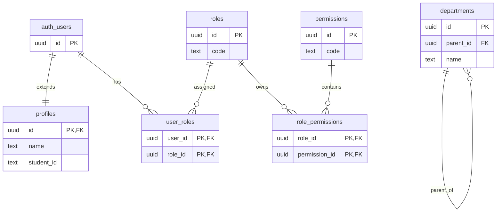
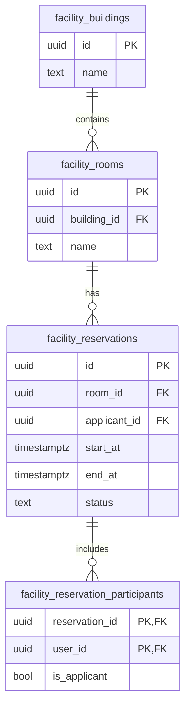
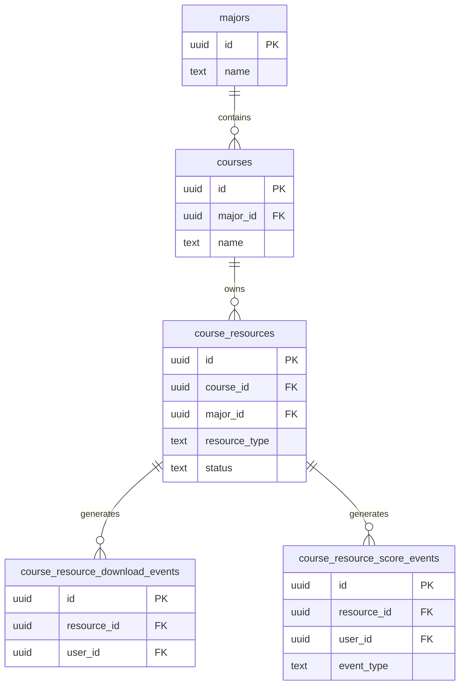
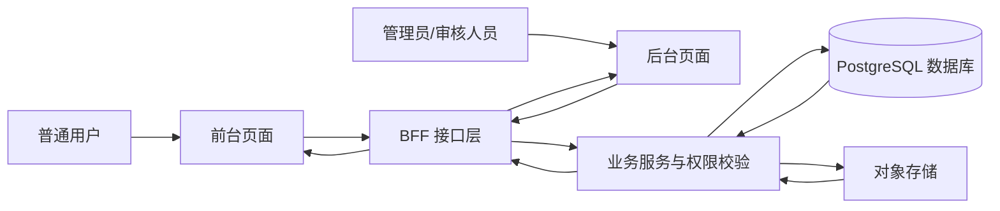

# 校园生活平台需求分析报告

## 1 项目内容、要求与完成情况总体介绍

### 1.1 项目内容

本次课程设计的题目为“校园生活平台”。系统面向校园日常管理与服务场景，结合本人已有 Web 开发课程设计项目基础，在本次数据库课程设计中重点对数据库相关内容进行重新梳理和完善。

本次需求分析主要围绕以下三个主线模块展开：

- 平台基础模块：身份与鉴权、组织结构、角色权限、数据范围、审计日志；
- 功能房预约模块：楼房、房间、预约、参与人、封禁与统计；
- 课程资源分享模块：专业、课程、资源投稿、审核、下载、推荐与积分。

数字图书馆模块作为可选扩展，在本次需求分析中只作简单说明，不作为主要展示对象。

### 1.2 课程设计要求理解

根据课程设计要求，本次工作重点不在界面效果，而在数据库设计。需求分析阶段需要先明确系统要解决什么问题、有哪些用户角色、有哪些核心业务流程、需要哪些数据对象，以及这些数据应满足什么基本规则。只有在需求分析明确之后，后续的 E-R 图、关系模式、外键约束和事务设计才有依据。

因此，本报告主要完成以下任务：

- 明确系统范围与主要任务；
- 分析主要角色及其业务需求；
- 归纳系统的功能要求与数据要求；
- 给出简单的数据字典、E-R 图和关系视图；
- 为后续数据库设计和实现打基础。

### 1.3 完成情况说明

本系统是在已有校园生活平台项目基础上，按数据库课程设计要求进行重点迭代和整理完成的。本次需求分析以“先完成基本要求、保证内容完整和逻辑清楚”为原则，不追求过度复杂的表达，而是力求把系统的主要需求说明清楚。

## 2 概要介绍

### 2.1 开发工具及环境

本系统当前使用的主要开发工具及环境如下：

| 类别 | 工具或环境 |
|------|------------|
| 开发语言 | TypeScript、SQL |
| 前端/服务端框架 | Next.js |
| 数据库 | PostgreSQL |
| 运行支撑环境 | Supabase 兼容 PostgreSQL 环境 |
| ORM 工具 | Drizzle ORM |
| 文档编写 | Markdown、Mermaid |
| 开发工具 | VS Code、pnpm、Git |

说明：

- 本次课程设计中的数据库设计口径统一按 PostgreSQL 展开；
- 当前项目使用兼容 PostgreSQL 的运行环境，重点仍放在数据库模型、约束和查询设计上。

### 2.2 任务分析

#### 2.2.1 任务分析

本次课程设计的主要任务，是在“校园生活平台”这一题目下，选择有代表性的业务模块进行数据库需求分析和建模。与普通软件工程项目相比，本次任务更强调以下内容：

- 是否能够识别清楚系统中的主要实体和联系；
- 是否能够区分主体数据、关系数据和过程数据；
- 是否能够明确功能要求、数据要求和完整性要求；
- 是否能够为后续数据库设计提供比较清晰的依据。

从系统现状来看，如果把所有历史模块都继续纳入分析，范围会过大，重点也会分散。因此，本次任务分析后决定聚焦数据库主线模块，而不再全面展开所有业务。

#### 2.2.2 系统设计目标

本系统的设计目标主要包括以下几个方面：

1. 建立统一的平台基础数据模型，为其他业务模块提供用户、组织、角色、权限和审计支撑。
2. 建立较清晰的功能房预约数据模型，使系统能够表达房间、预约、参与人和封禁等业务对象。
3. 建立课程资源分享数据模型，使系统能够表达专业、课程、资源、审核、下载和积分等业务关系。
4. 在数据库设计阶段尽量体现规范化思想，并通过主键、外键、唯一约束和检查约束保证数据正确性。
5. 形成一份内容完整、结构清楚、能够服务后续数据库设计的需求分析报告。

### 2.3 需求分析

#### 2.3.1 功能要求

本系统的主要功能要求如下。

##### 1. 平台基础模块

- 支持用户注册、登录和基本资料维护；
- 支持用户状态管理，如审核、启用、停用、封禁；
- 支持部门和岗位管理；
- 支持角色、权限和用户角色分配；
- 支持按模块配置数据范围；
- 支持对关键管理操作记录审计日志。

##### 2. 功能房预约模块

- 支持楼房和房间基础信息管理；
- 支持按楼房、楼层和时间窗口查询房间占用情况；
- 支持用户提交预约申请并维护参与人；
- 支持工作人员审核预约；
- 支持用户取消预约和驳回后重新提交；
- 支持封禁违规用户；
- 支持按时间窗口统计房间和用户使用情况。

##### 3. 课程资源分享模块

- 支持专业、课程和专业负责人管理；
- 支持用户创建资源草稿；
- 支持上传文件或填写外链；
- 支持资源提交审核、通过、驳回和下架；
- 支持已发布资源查询和下载；
- 支持推荐资源和记录积分事件；
- 支持资源统计和用户积分排行。

#### 2.3.2 数据要求

本系统涉及的主要数据要求如下。

##### 1. 平台基础数据要求

- 每个用户应有唯一标识；
- 用户资料与用户身份应建立稳定对应关系；
- 部门之间应能表示层级关系；
- 用户与部门、岗位、角色之间应支持多对多关系；
- 角色与权限之间应支持多对多关系；
- 审计日志应能记录操作者、动作、对象、时间和结果。

##### 2. 功能房预约数据要求

- 房间必须属于某一楼房；
- 每条预约必须关联房间和申请人；
- 一条预约可关联多个参与人；
- 同一房间在有效预约状态下不应出现冲突时间段；
- 预约应能表示待审、通过、驳回、取消等状态；
- 封禁记录应能表示是否生效、是否过期和是否撤销。

##### 3. 课程资源分享数据要求

- 课程必须归属于某一专业；
- 一个专业可以配置多个负责人；
- 每条资源必须关联课程；
- 资源应区分文件型和外链型两类；
- 审核信息应能记录审核人、审核时间和审核意见；
- 下载记录、推荐记录和积分记录应与资源主体分开建模。

#### 2.3.3 数据字典

为便于后续数据库设计，现对系统中的主要数据对象作简要说明，见表 2-1。

| 数据对象 | 主要字段 | 说明 |
|----------|----------|------|
| 用户资料 `profiles` | `id`、`name`、`student_id`、`status` | 保存用户业务资料和状态 |
| 部门 `departments` | `id`、`name`、`parent_id` | 保存组织层级 |
| 角色 `roles` | `id`、`code`、`name` | 保存角色信息 |
| 权限 `permissions` | `id`、`code` | 保存权限字典 |
| 房间 `facility_rooms` | `id`、`building_id`、`floor_no`、`name` | 保存房间基础数据 |
| 预约 `facility_reservations` | `id`、`room_id`、`applicant_id`、`start_at`、`end_at`、`status` | 保存预约主体信息 |
| 参与人 `facility_reservation_participants` | `reservation_id`、`user_id`、`is_applicant` | 保存预约参与人 |
| 专业 `majors` | `id`、`name` | 保存专业信息 |
| 课程 `courses` | `id`、`major_id`、`name` | 保存课程信息 |
| 课程资源 `course_resources` | `id`、`course_id`、`resource_type`、`status`、`created_by` | 保存资源主体信息 |
| 下载事件 `course_resource_download_events` | `id`、`resource_id`、`user_id`、`occurred_at` | 保存资源下载事实 |
| 积分事件 `course_resource_score_events` | `id`、`user_id`、`resource_id`、`event_type`、`delta` | 保存积分变化事实 |
| 审计日志 `audit_logs` | `id`、`actor_user_id`、`action`、`target_type`、`target_id` | 保存关键管理行为记录 |

#### 2.3.4 系统 E-R 图

由于系统包含多个模块，如果把所有关系放到同一张图中会比较混乱，因此这里给出较基础的分模块 E-R 图。

##### （1）平台基础模块 E-R 图

##### （2）功能房预约模块 E-R 图

##### （3）课程资源分享模块 E-R 图

#### 2.3.5 数据库关系视图

根据当前需求分析，可将系统的主要关系简要表示如下：

- `PROFILES(id, name, student_id, status)`
- `DEPARTMENTS(id, name, parent_id)`
- `ROLES(id, code, name)`
- `PERMISSIONS(id, code)`
- `USER_ROLES(user_id, role_id)`
- `ROLE_PERMISSIONS(role_id, permission_id)`
- `FACILITY_BUILDINGS(id, name, enabled)`
- `FACILITY_ROOMS(id, building_id, floor_no, name, capacity)`
- `FACILITY_RESERVATIONS(id, room_id, applicant_id, start_at, end_at, status)`
- `FACILITY_RESERVATION_PARTICIPANTS(reservation_id, user_id, is_applicant)`
- `MAJORS(id, name, enabled)`
- `COURSES(id, major_id, name, code)`
- `COURSE_RESOURCES(id, major_id, course_id, resource_type, status, created_by)`
- `COURSE_RESOURCE_DOWNLOAD_EVENTS(id, resource_id, user_id, occurred_at)`
- `COURSE_RESOURCE_SCORE_EVENTS(id, user_id, resource_id, event_type, delta)`
- `AUDIT_LOGS(id, actor_user_id, action, target_type, target_id, occurred_at)`

上述关系视图只是需求分析阶段的简化表达，后续还需要进一步补充主键、外键、唯一约束和检查约束。

#### 2.3.6 系统设计流程图

系统总体处理流程可简化表示如下：

该流程图表明，本系统以前后端分层方式组织，数据库是核心数据管理中心，权限校验、业务规则和数据访问围绕数据库展开。

### 2.4 功能模块设计

本系统可按功能划分为若干模块，见表 2-2。

| 模块名称 | 子模块 | 主要功能 |
|----------|--------|----------|
| 平台基础模块 | 用户管理 | 注册、登录、状态管理、资料维护 |
| 平台基础模块 | 组织管理 | 部门管理、岗位管理、用户部门/岗位分配 |
| 平台基础模块 | 权限管理 | 角色管理、权限管理、用户角色分配、数据范围配置 |
| 平台基础模块 | 审计与配置 | 审计日志记录与查询、系统配置维护 |
| 功能房预约模块 | 基础数据管理 | 楼房管理、房间管理 |
| 功能房预约模块 | 预约业务 | 占用查询、预约申请、参与人维护、审核、取消、重提 |
| 功能房预约模块 | 运营管理 | 封禁管理、统计排行 |
| 课程资源分享模块 | 教学基础数据 | 专业管理、课程管理、专业负责人配置 |
| 课程资源分享模块 | 资源业务 | 草稿创建、编辑、文件/外链录入、提交审核 |
| 课程资源分享模块 | 审核与统计 | 审核、下架、推荐、下载记录、积分排行 |

## 3 需求分析结论

通过以上分析可以看出，校园生活平台并不是简单的信息录入系统，而是一个具有多角色、多关系、多状态和多约束特征的业务系统。

从需求分析结果来看：

- 平台基础模块为其他模块提供统一的数据治理基础；
- 功能房预约模块重点体现时间资源管理和预约流程控制；
- 课程资源分享模块重点体现审核流、事件记录和统计分析；
- 系统在后续数据库设计中需要重点考虑实体联系、完整性约束、事务一致性和统计查询支撑。

因此，本次需求分析已经能够为后续 E-R 图设计、关系模式设计和数据库实现提供基本依据，也满足课程设计对需求分析阶段的基本要求。
