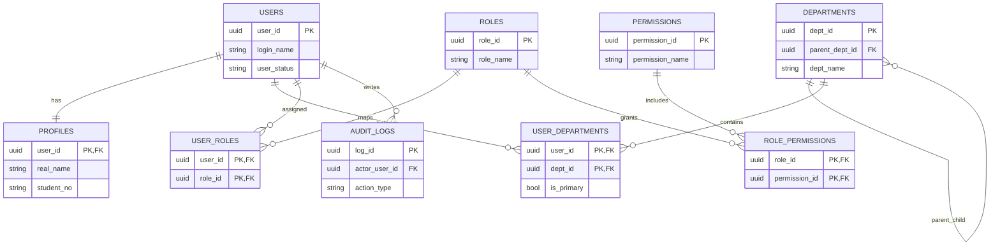
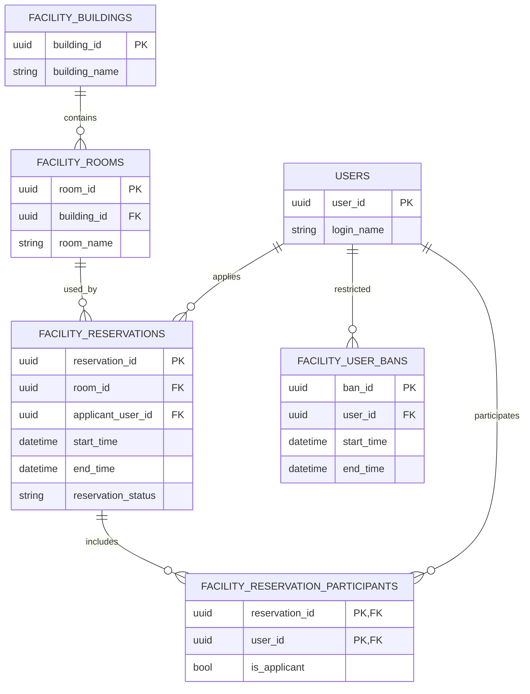
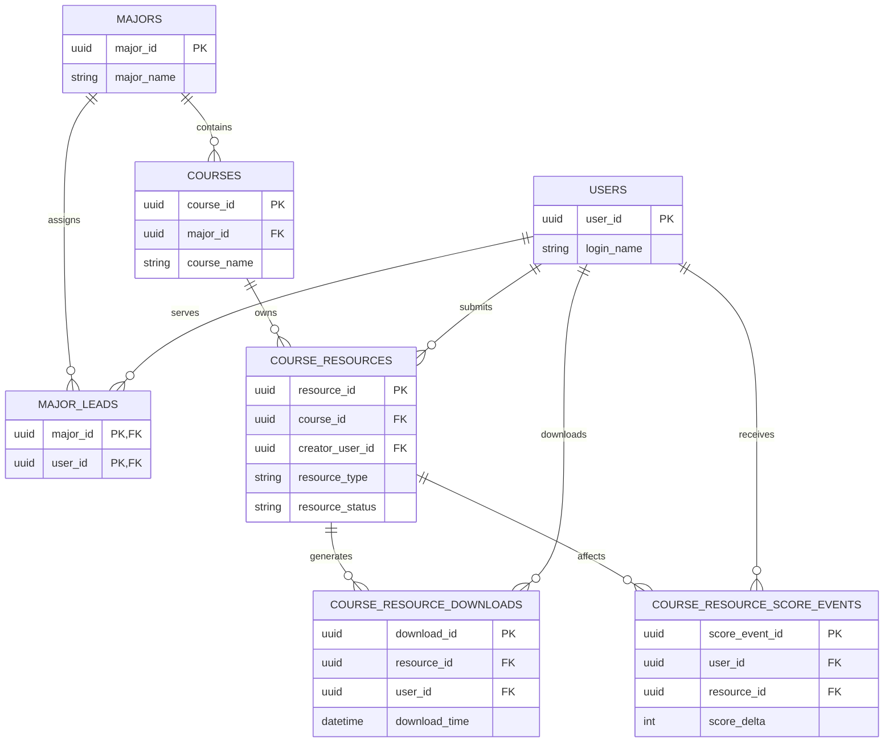
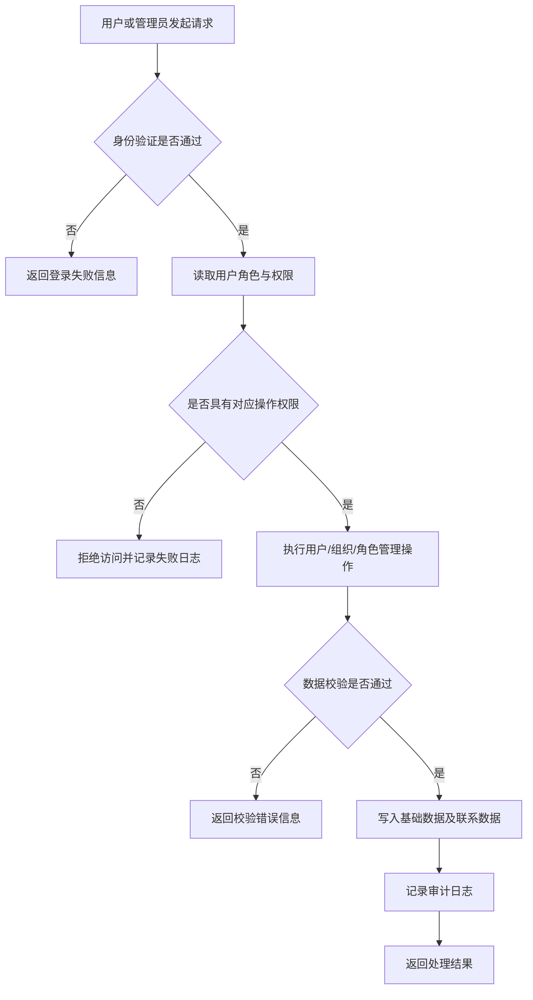
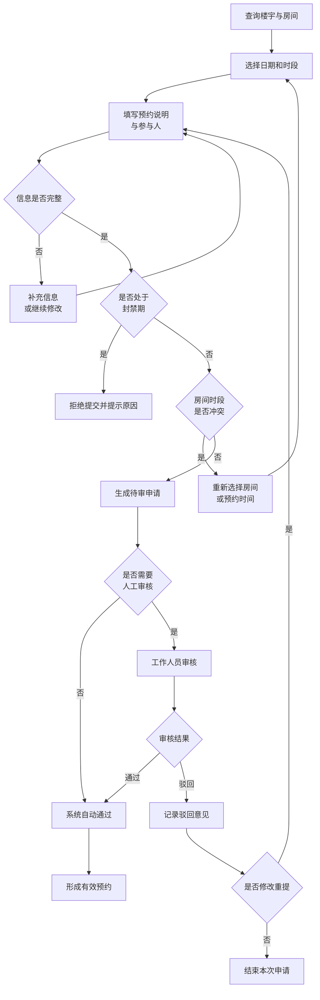
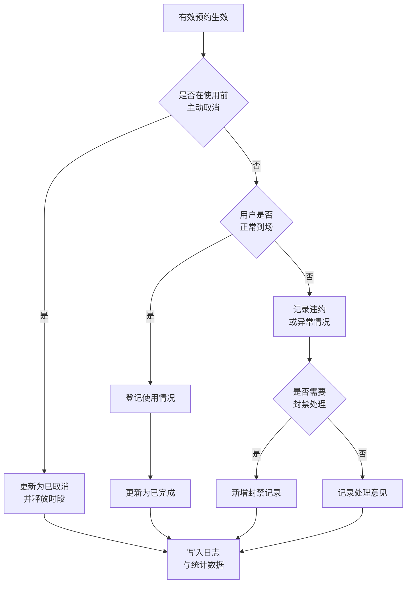
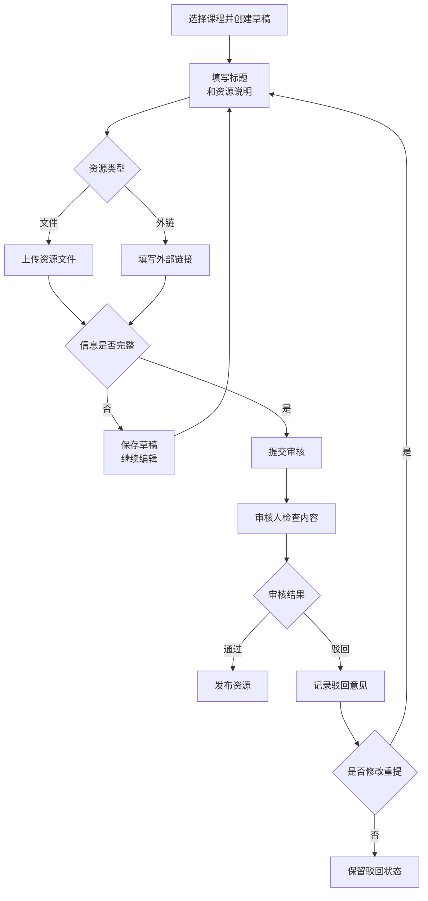
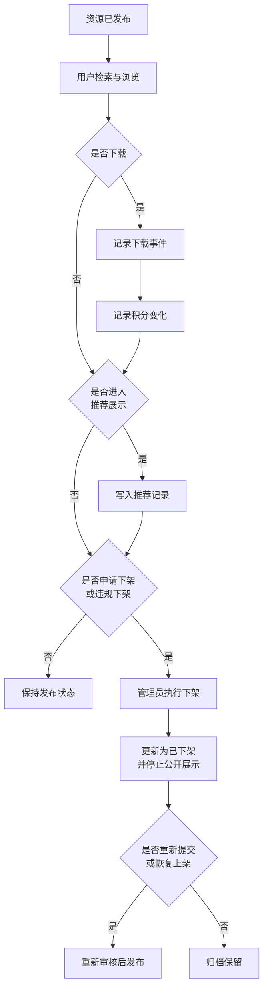

# 校园生活平台需求分析报告

校园生活平台原有业务范围较广。结合《数据库原理及应用》课程设计的考核重点，本文将平台基础管理、功能房预约和课程资源分享三个模块作为本次需求分析的主要对象，重点说明系统需要支持的业务活动、需要保存的数据对象及其联系，以及这些数据在后续数据库设计中应满足的基本约束。

从业务特点来看，这三个模块既包含用户、组织、角色、权限等公共基础数据，也包含预约、审核、资源发布、下载记录和积分记录等过程性数据，能够较好体现数据库课程设计中对实体识别、联系抽取、规范化处理和完整性约束设计的要求。

## 1 功能需求分析

### 1.1 平台基础管理模块

平台基础管理模块负责为其他业务模块提供统一的身份、组织和权限支撑。该模块的功能需求不仅关系到用户能否正常使用系统，也直接影响后续数据库中用户表、组织表、角色表、权限表及相关联系表的设计方式。其主要功能需求如表 1-1 所示。

| 编号 | 功能要求 |
| --- | --- |
| PF-01 | 系统应支持用户完成注册、登录、退出和基本身份验证。 |
| PF-02 | 系统应支持维护真实姓名、学号、联系方式等个人资料信息。 |
| PF-03 | 管理员应能够对用户执行审核、启用、停用和封禁等状态管理操作。 |
| PF-04 | 系统应支持部门信息的新增、修改、删除及上下级关系维护。 |
| PF-05 | 系统应支持岗位信息维护，并允许用户与岗位建立对应关系。 |
| PF-06 | 系统应支持角色维护、权限定义和用户角色分配。 |
| PF-07 | 系统应支持按业务模块配置角色的数据访问范围。 |
| PF-08 | 系统应自动记录关键管理行为，并支持按用户、时间和模块查询审计日志。 |

### 1.2 功能房预约模块

功能房预约模块主要面向校园公共空间的查询、申请和审核管理。该模块的功能设计需要能够完整表达房间资源、预约申请、审核处理和使用统计等业务过程，其主要功能需求如表 1-2 所示。

| 编号 | 功能要求 |
| --- | --- |
| FR-01 | 系统应支持楼房和房间基础信息的维护，包括名称、位置、容量等内容。 |
| FR-02 | 系统应支持按楼房、楼层和时间段查询房间的占用情况。 |
| FR-03 | 普通用户应能够提交预约申请，并填写预约时间、使用用途和申请说明。 |
| FR-04 | 系统应支持在预约申请中维护参与人信息。 |
| FR-05 | 工作人员应能够对预约申请执行通过或驳回处理，并记录审核意见。 |
| FR-06 | 用户应能够查询本人预约记录，并在符合条件时取消预约。 |
| FR-07 | 对于被驳回的预约，系统应允许用户修改后重新提交。 |
| FR-08 | 系统应支持对违规用户进行封禁管理，并限制其在封禁期间提交预约。 |
| FR-09 | 系统应支持按时间范围统计房间使用情况和用户使用情况。 |

### 1.3 课程资源分享模块

课程资源分享模块主要面向教学资料的投稿、审核、发布和使用统计。该模块除了要保存资源主体信息外，还需要表达围绕资源产生的审核、下载、推荐和积分变化等行为数据，其主要功能需求如表 1-3 所示。

| 编号 | 功能要求 |
| --- | --- |
| CR-01 | 系统应支持专业和课程基础信息维护。 |
| CR-02 | 系统应支持为每个专业配置相应负责人。 |
| CR-03 | 普通用户应能够选择课程并创建资源草稿。 |
| CR-04 | 系统应支持资源标题、说明、文件地址或外部链接等内容录入。 |
| CR-05 | 用户应能够将草稿提交审核，并查询资源当前状态。 |
| CR-06 | 审核人员应能够对资源执行通过、驳回和下架处理。 |
| CR-07 | 已发布资源应支持按专业、课程和关键词进行查询。 |
| CR-08 | 系统应支持资源浏览与下载，并记录下载行为。 |
| CR-09 | 系统应支持资源推荐管理，并保存推荐记录。 |
| CR-10 | 系统应支持记录积分变化，并用于后续排行或统计分析。 |

综合来看，三个模块虽然面向的业务对象不同，但都需要在数据库中清楚表达用户、对象、状态、联系和日志等核心信息。因此，功能需求分析的结果将直接影响后续实体设计、联系设计和完整性约束设计。

## 2 数据需求分析

### 2.1 平台基础管理模块

平台基础管理模块中的核心数据包括用户身份数据、用户资料数据、部门数据、岗位数据、角色数据、权限数据、数据范围规则和审计日志数据。其中，用户身份数据与用户资料数据之间应保持一对一对应关系，部门数据应能够表达上下级层次结构，用户与部门、用户与岗位、用户与角色、角色与权限之间则应通过联系表表示多对多关系。

从完整性要求来看，用户必须具有唯一标识，登录名或学号等关键业务属性应具有唯一性；角色编码、权限编码等也应保持唯一，以避免权限定义出现歧义。对于审计日志数据，系统应能够保存操作者、操作时间、操作对象、操作类型和处理结果，从而为后续责任追踪提供依据。

### 2.2 功能房预约模块

功能房预约模块中的核心数据包括楼房数据、房间数据、预约主体数据、预约参与人数据和用户封禁数据。楼房与房间之间构成稳定的一对多关系，房间不能脱离楼房单独存在；预约主体必须同时关联房间和申请人，而参与人信息则应通过独立联系表保存，以避免在预约主表中重复存储人员信息。

从完整性要求来看，预约记录应能够表示申请时间、开始时间、结束时间、预约状态、审核信息和使用说明等内容，并保证结束时间晚于开始时间。同一房间在有效预约状态下不应出现时间冲突；封禁记录应能表达封禁原因、生效时间、失效时间和当前状态，使系统能够据此判断某一用户是否具备预约资格。

### 2.3 课程资源分享模块

课程资源分享模块中的核心数据包括专业数据、课程数据、专业负责人关系数据、资源主体数据、下载记录数据、推荐记录数据和积分事件数据。专业与课程之间应保持一对多关系，专业负责人与专业之间应通过联系表建立对应关系。资源主体应明确对应某一课程和某一提交用户，并能够表示资源类型、资源状态、提交时间和审核信息。

从完整性要求来看，文件型资源和链接型资源应根据资源类型保存不同的内容字段，资源状态应能够反映草稿、待审、已发布、已驳回和已下架等业务含义。下载、推荐和积分变化等行为数据不宜直接写入资源主表，而应通过独立事件表进行记录，以便后续进行统计分析并减少更新异常。

由以上分析可以看出，本系统的数据需求不仅涉及实体本身的属性设计，也涉及实体之间的联系设计、状态设计和行为记录设计。只有在需求阶段将这些数据要求表述清楚，后续数据库设计中的主键、外键、唯一约束和检查约束才能具备明确依据。

## 3 数据字典

为便于后续数据库设计，下面按模块给出系统中的主要数据对象及其关键属性说明。

### 3.1 平台基础管理模块

| 数据对象 | 关键属性 | 说明 |
| --- | --- | --- |
| `users` | `user_id`、`login_name`、`user_status` | 保存系统用户身份信息 |
| `profiles` | `user_id`、`real_name`、`student_no`、`phone` | 保存用户个人资料 |
| `departments` | `dept_id`、`parent_dept_id`、`dept_name` | 保存组织结构信息 |
| `positions` | `position_id`、`position_name` | 保存岗位信息 |
| `roles` | `role_id`、`role_code`、`role_name` | 保存角色信息 |
| `permissions` | `permission_id`、`permission_code`、`permission_name` | 保存权限定义 |
| `user_roles` | `user_id`、`role_id` | 保存用户与角色的对应关系 |
| `audit_logs` | `log_id`、`actor_user_id`、`action_type`、`action_time` | 保存关键管理操作日志 |

### 3.2 功能房预约模块

| 数据对象 | 关键属性 | 说明 |
| --- | --- | --- |
| `facility_buildings` | `building_id`、`building_name` | 保存楼房基础信息 |
| `facility_rooms` | `room_id`、`building_id`、`room_name`、`capacity` | 保存房间基础信息 |
| `facility_reservations` | `reservation_id`、`room_id`、`applicant_user_id`、`start_time`、`end_time`、`reservation_status` | 保存预约主体信息 |
| `facility_reservation_participants` | `reservation_id`、`user_id`、`is_applicant` | 保存预约参与人信息 |
| `facility_user_bans` | `ban_id`、`user_id`、`start_time`、`end_time`、`ban_status` | 保存用户封禁信息 |

### 3.3 课程资源分享模块

| 数据对象 | 关键属性 | 说明 |
| --- | --- | --- |
| `majors` | `major_id`、`major_name` | 保存专业信息 |
| `courses` | `course_id`、`major_id`、`course_name` | 保存课程信息 |
| `major_leads` | `major_id`、`user_id` | 保存专业负责人关系 |
| `course_resources` | `resource_id`、`course_id`、`creator_user_id`、`resource_type`、`resource_status` | 保存资源主体信息 |
| `course_resource_downloads` | `download_id`、`resource_id`、`user_id`、`download_time` | 保存资源下载记录 |
| `course_resource_recommendations` | `recommend_id`、`resource_id`、`operator_user_id`、`recommend_time` | 保存资源推荐记录 |
| `course_resource_score_events` | `score_event_id`、`user_id`、`resource_id`、`score_delta` | 保存积分变化记录 |

## 4 系统 E-R 图

为了避免将全部实体关系集中在一张图中造成阅读困难，下面按模块分别给出系统的核心 E-R 图。图中只展示主要实体及其基本联系，具体字段约束和辅助表将在后续数据库设计阶段继续细化。

### 4.1 平台基础管理模块 E-R 图

### 4.2 功能房预约模块 E-R 图

### 4.3 课程资源分享模块 E-R 图

由以上 E-R 图可以看出，系统的公共基础数据与各业务模块之间保持相对清晰的支撑关系，而每个业务模块内部又具有较明确的主从结构和联系结构。这种分模块表达方式比将全部关系堆叠在一张图中更便于阅读，也更适合作为后续关系模式转换和完整性约束设计的依据。

## 5 数据库关系视图

### 5.1 平台基础管理模块

平台基础模块主要负责表达用户、组织和权限之间的关系。除主体关系外，该模块还包含用户与部门、用户与岗位、用户与角色、角色与权限之间的联系关系，以及数据范围规则和审计日志等管理性关系。其主要关系视图如表 5-1 所示。

| 关系名 | 主要属性 | 关系说明 |
| --- | --- | --- |
| `USERS` | `user_id`，`login_name`，`email`，`password_hash`，`user_status` | 保存用户身份信息 |
| `PROFILES` | `user_id`，`real_name`，`student_no`，`gender`，`phone` | 保存用户个人资料 |
| `DEPARTMENTS` | `dept_id`，`parent_dept_id`，`dept_name` | 保存部门层级结构 |
| `POSITIONS` | `position_id`，`position_name` | 保存岗位信息 |
| `USER_DEPARTMENTS` | `user_id`，`dept_id`，`is_primary` | 保存用户与部门对应关系 |
| `USER_POSITIONS` | `user_id`，`position_id` | 保存用户与岗位对应关系 |
| `ROLES` | `role_id`，`role_code`，`role_name` | 保存角色信息 |
| `PERMISSIONS` | `permission_id`，`permission_code`，`permission_name` | 保存权限定义 |
| `USER_ROLES` | `user_id`，`role_id` | 保存用户与角色对应关系 |
| `ROLE_PERMISSIONS` | `role_id`，`permission_id` | 保存角色与权限对应关系 |
| `DATA_SCOPE_RULES` | `scope_id`，`role_id`，`module_code`，`scope_type` | 保存角色的数据范围规则 |
| `AUDIT_LOGS` | `log_id`，`actor_user_id`，`action_type`，`target_type`，`target_id`，`action_time`，`action_result` | 保存关键管理操作日志 |

从上述关系可以看出，平台基础模块的特点是主体关系与联系关系并存，多对多关系通过独立关系表进行展开。这种处理方式有利于减少冗余，也便于后续通过外键维护引用完整性。

### 5.2 功能房预约模块

功能房预约模块主要负责表达楼房、房间、预约申请、参与人和封禁记录之间的关系。这部分关系既反映静态空间对象，也反映预约过程中的状态变化和参与情况，其主要关系视图如表 5-2 所示。

| 关系名 | 主要属性 | 关系说明 |
| --- | --- | --- |
| `FACILITY_BUILDINGS` | `building_id`，`building_name`，`location` | 保存楼房基础信息 |
| `FACILITY_ROOMS` | `room_id`，`building_id`，`floor_no`，`room_name`，`capacity` | 保存房间基础信息 |
| `FACILITY_RESERVATIONS` | `reservation_id`，`room_id`，`applicant_user_id`，`start_time`，`end_time`，`use_purpose`，`reservation_status`，`reviewer_user_id`，`review_time`，`review_comment` | 保存预约主体和审核信息 |
| `FACILITY_RESERVATION_PARTICIPANTS` | `reservation_id`，`user_id`，`is_applicant` | 保存预约参与人关系 |
| `FACILITY_USER_BANS` | `ban_id`，`user_id`，`start_time`，`end_time`，`ban_reason`，`ban_status` | 保存用户封禁记录 |

这一模块中，房间依附于楼房存在，预约依附于房间和申请用户存在，参与人和封禁记录分别承担联系信息和过程状态信息的保存功能。这样处理以后，预约主表能够集中表达一次预约的核心事实，而重复发生的参与和限制信息则由独立关系承担，结构上更加清晰。

### 5.3 课程资源分享模块

课程资源分享模块主要负责表达专业、课程、资源主体以及围绕资源产生的下载、推荐和积分等业务行为。与前两个模块相比，这一部分更强调教学层级和资源事件的分离，其主要关系视图如表 5-3 所示。

| 关系名 | 主要属性 | 关系说明 |
| --- | --- | --- |
| `MAJORS` | `major_id`，`major_name` | 保存专业信息 |
| `COURSES` | `course_id`，`major_id`，`course_name`，`course_code` | 保存课程信息 |
| `MAJOR_LEADS` | `major_id`，`user_id` | 保存专业负责人关系 |
| `COURSE_RESOURCES` | `resource_id`，`course_id`，`creator_user_id`，`resource_title`，`resource_type`，`resource_status`，`storage_uri`，`external_url`，`submitted_at`，`reviewed_by`，`reviewed_at` | 保存资源主体信息 |
| `COURSE_RESOURCE_DOWNLOADS` | `download_id`，`resource_id`，`user_id`，`download_time` | 保存资源下载记录 |
| `COURSE_RESOURCE_RECOMMENDATIONS` | `recommend_id`，`resource_id`，`operator_user_id`，`recommend_time`，`recommend_status` | 保存资源推荐记录 |
| `COURSE_RESOURCE_SCORE_EVENTS` | `score_event_id`，`user_id`，`resource_id`，`event_type`，`score_delta`，`occurred_at` | 保存积分变化记录 |

这一模块中，专业、课程和资源主体构成稳定的主线结构，而下载、推荐和积分等行为数据独立成表，既可以避免把多次发生的事实压缩在一条资源记录中，也有利于后续进行统计、排序和审计分析。

## 6 系统设计流程图

### 6.1 平台基础管理模块

平台基础管理模块的处理流程主要围绕身份识别、权限校验、基础管理操作和日志记录展开。与简单的线性处理不同，该模块在身份验证失败、权限不足和数据校验失败等情况下都应产生不同处理结果，其基本流程如图所示。

### 6.2 功能房预约模块

功能房预约模块的业务处理并不是单一路径，而是可以分为“预约申请与审核”和“履约变更与异常处理”两个阶段。前一阶段强调申请提交前后的规则校验和审核流转，后一阶段强调预约生效后的取消、违约和封禁处理。

预约生效后，系统还需要继续处理用户取消、正常使用、爽约违约和封禁处置等后续状态变化，其履约变更与异常处理流程如图所示。

### 6.3 课程资源分享模块

课程资源分享模块同样可以分为“资源投稿与审核”和“发布后的使用与下架”两个阶段。前一阶段重点体现草稿、提交审核、驳回重提等业务状态，后一阶段重点体现发布后下载、推荐、积分记录和下架处理等过程。

资源发布后，系统还需要继续处理检索浏览、下载记录、积分变化、推荐展示、申请下架或违规下架等后续活动，其发布后的使用与下架流程如图所示。

从整体流程上看，三个模块虽然面向的业务对象不同，但都遵循“输入业务信息、执行规则校验、写入数据库并保存处理结果”的基本处理逻辑。数据库始终处于系统运行的核心位置，既承担业务事实的存储功能，也承担后续统计分析和约束控制的基础支撑作用。
