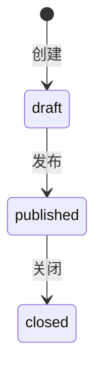

# 收集引擎（Collect Engine）需求说明（MVP）

**状态**：✅ 已批准  
**版本**：v1.0（MVP）  
**最近更新**：2025-12-20

> 定位：为“问卷/材料/报名/投票”等“收集型场景”提供可复用的后端能力（任务、可见范围、提交、处理、导出），各业务模块只做薄适配（module 配置 + source 关联规则）。

## 1. 范围（Scope）

### 1.1 MVP（本轮必须实现）
- **任务（CollectTask）**：`draft → published → closed`，支持 `archived`（归档后仅用于查询/导出）
  - 截止时间 `dueAt`（硬截止）：`now > dueAt` 时禁止上传/提交（不做提醒、不自动关闭）
- **可见范围（Audience）**：`visibleAll + scopes(role/department/position OR)`
- **来源关联（Source Link）**：任务可选关联一个来源对象（如通知公告）
  - 当存在关联时：任务可见范围**继承来源对象**
  - 当不存在关联时：任务可见范围使用任务自身配置
- **项（CollectItem）**：支持 `required`、排序、说明
  - MVP 仅实现 `kind=file`（文件题）
  - 文件题支持材料项级模板下载（0~1）
- **提交（CollectSubmission）**：同一用户对同一任务最多 1 份（覆盖式）
  - 支持撤回：撤回后立即物理删除文件对象，并清空文件记录（保留提交记录与审计元数据）
- **处理（Console）**：状态 `pending/complete/need_more/approved/rejected` + 经办人分配 + 批量处理
- **检索（Console）**：学号、姓名、提交时间范围、部门、状态、是否缺材料
- **导出（Console）**：按任务维度导出 ZIP（支持过滤），附 `manifest.csv`
  - 默认仅导出已提交（`submittedAt != null`）；可选 `includeUnsubmitted=true` 包含未提交

### 1.2 非目标（Out of Scope）
- 审批流引擎（节点/会签/抄送等）
- 提交版本历史与差异对比
- 全量异步导出任务（job）与长期缓存（MVP 先做同步导出 + 体量上限兜底）

## 2. 领域模型（概览）

### 2.1 核心实体
- `collect_tasks`：收集任务（module 维度隔离）
- `collect_task_scopes`：任务自身可见范围（仅在无 source 时生效）
- `collect_items`：任务项（MVP 为文件题）
- `collect_submissions`：用户提交（一人一份）
- `collect_submission_files`：提交文件（归属某任务项）

### 2.2 关联与继承规则
- `collect_tasks.source_type/source_id` 表示关联来源（如 `notice`）
- 若 `source` 存在：任务可见范围继承来源对象（例如通知公告的 `visibleAll + notice_scopes`）
- 若 `source` 为空：任务可见范围使用任务自身 `visibleAll + collect_task_scopes`

## 3. 状态机与关键规则

### 3.1 任务状态

### 3.2 发布后锁定结构（MVP 冻结）
- 任务处于 `draft` 时可编辑任务项结构（增删改/排序/必填）
- 任务发布后（`published/closed`）不允许变更任务项结构（避免处理中途口径变化）

### 3.2.1 截止时间（MVP 冻结）
- 发布要求 `dueAt` 非空且晚于当前时间。
- Portal 上传/删除/提交均以 `dueAt` 做硬截止：`now > dueAt` 直接拒绝。
- 发布后允许修改 `dueAt`（仅截止；结构仍锁定）。

### 3.3 提交与撤回（MVP 冻结）
- 同一用户对同一任务最多 1 份提交（覆盖式，不保留版本）
- 撤回：仅允许本人撤回；撤回后立即物理删除 Storage 对象并清空文件记录

### 3.4 缺材料判定（MVP 冻结）
- 基于 `required=true` 的任务项：任一必交项文件数为 0 → `missingRequired=true`

### 3.5 导出安全（MVP 冻结）
- ZIP 路径必须做路径安全处理（禁止 `../`、绝对路径等）
- `manifest.csv` 需做 CSV 注入防护（防止 Excel 公式注入）

## 4. RBAC 与 DataScope（约定）
- Console 权限码格式：`campus:<module>:<op>`，其中 `<module>` 必须是单词（例如 `material`）
- DataScope：`module=<module>`，Console 下“可见数据”默认按 DataScope 过滤；具备 `campus:<module>:manage` 时可在 DataScope 范围内操作他人创建的数据（但不越过 DataScope）
