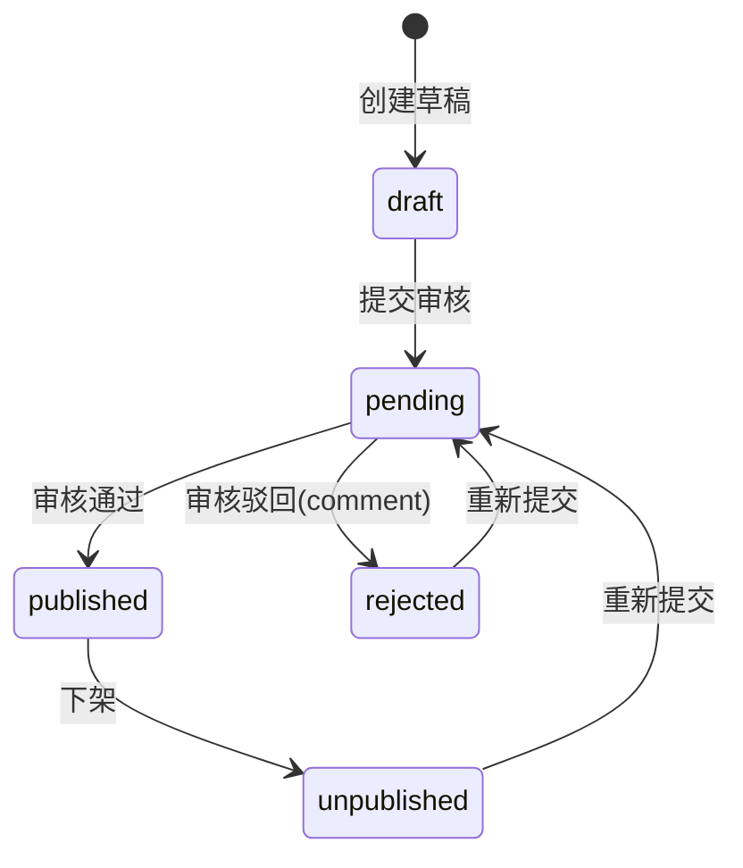

# 课程资源分享模块需求说明（MVP 冻结草案）

**状态**：🟠 待冻结（等待确认）  
**版本**：v1.0-draft（MVP）  
**最近更新**：2025-12-18

> 业务参考来源：`campus-hub-ruoyi/docs/requirements/课程资源分享.md`（仅作为业务输入；本仓库按 `campus-hub-next` 架构与最佳实践重构落地）。  
> 目标：在不引入额外付费/复杂基础设施的前提下，落地一个“可运行、可测试、可部署”的课程资源分享 MVP。

## 1. 目标与定位

- 面向“专业 → 课程 → 资源”的资料分享、审核发布与检索。
- 支持两类资源：
  - 文件：仅压缩包（`zip/rar/7z`），最大 200MB
  - 外链：URL（由审核把关有效性）
- 提供下载计数与排行榜（资源榜 / 用户积分榜），并支持“最佳推荐”标记。

## 2. 范围（Scope）

### 2.1 MVP（本轮必须实现）

**基础数据**
- 专业（Major）管理：增删改查（管理端）
- 课程（Course）管理：增删改查（管理端）
- 专业负责人（major_lead）配置：一个专业可配置多个负责人（管理端）

**资源流程**
- 资源投稿：创建草稿、编辑、删除（软删）、提交审核
- 审核：通过/驳回（带 comment）
- 发布态：已发布可下架；驳回/下架可重新提交
- 下载：统一通过下载入口计数，再跳转（文件为 signed url；外链为 302 到规范化 URL）

**排序与榜单**
- 资源下载榜：支持 days 窗口；支持 scope（全站/按专业/按课程）
- 用户积分榜：支持全站/按专业；展示代表作 Top5；支持查看某用户的“全部代表作”

**最佳推荐与积分**
- “最佳推荐”标记：同一资源至多 1 条最佳标记；可取消
- 积分发放（可配置，且必须保证“首次语义”）：
  - 资源**第一次**审核通过：+5（默认）
  - 资源**第一次**被标记为最佳：+10（默认）

### 2.2 非目标（Out of Scope）

- 付费下载/积分兑换、P2P 传输
- 复杂防刷（限流/反作弊/风控）——MVP 仅保留最小扩展点
- 资源版本管理（已发布版本 + 新修订待审并存）

## 3. 角色与权限（RBAC + 领域范围）

说明：
- Portal 端：仅要求登录（`requireUser`），不强制权限码。
- Console 端：按权限码（RBAC）控制入口；同时在 Service 层强制执行“专业负责人范围”过滤（领域范围）。

### 3.1 角色

- `user`：浏览、下载、投稿与管理“我上传的资源”。
- `major_lead`：具备 user 能力；在管理端仅能管理/审核其负责专业内的数据（课程/资源）。
- `admin` / `super_admin`：跨专业全量管理（专业/负责人/课程/资源/审核/硬删除等）。

### 3.2 专业负责人范围（冻结）

- `major_lead` 的“负责哪些专业”不编码在权限码中，而是由**映射表**维护（见 7.2 `major_leads`）。
- 约束：
  - 一个用户可负责多个专业（多行映射）。
  - 一个专业可配置多个负责人（多行映射）。
- 强制口径：Console 端所有与“专业/课程/资源”相关的查询与操作，必须在后端按该映射表做范围过滤；前端隐藏仅用于 UX，不作为安全边界。

### 3.2 权限码（建议，module=resource）

> 约定：保持 3 段权限码（`campus:<module>:<op>`），避免引入多段权限码导致通配匹配不可控。

- 专业（admin/super_admin）
  - `campus:resource:major_list`
  - `campus:resource:major_create`
  - `campus:resource:major_update`
  - `campus:resource:major_delete`
  - `campus:resource:major_lead_update`（配置专业负责人）
- 课程（admin 全量；major_lead 仅本专业范围）
  - `campus:resource:course_list`
  - `campus:resource:course_create`
  - `campus:resource:course_update`
  - `campus:resource:course_delete`
- 资源（管理端）
  - `campus:resource:list`
  - `campus:resource:read`
  - `campus:resource:review`（approve/reject）
  - `campus:resource:offline`（下架）
  - `campus:resource:best`（best/unbest）
  - `campus:resource:stats`
  - `campus:resource:delete`（硬删除；仅 admin/super_admin）

## 4. 关键用例（Use Cases）

- UC-R1：作为 user，在 `/resources` 浏览专业 → 课程 → 已发布资源列表，并可下载。
- UC-R2：作为 user，在“我上传的”中创建草稿并上传文件/填写外链，提交审核。
- UC-R3：作为 major_lead，在 `/console/resources` 审核本专业待审资源：通过/驳回（填写理由）。
- UC-R4：作为 major_lead，对本专业已发布资源执行下架维护；不可硬删除。
- UC-R5：作为 admin/super_admin，跨专业管理专业/课程/负责人，审核资源，硬删除资源。
- UC-R6：作为任意登录用户，查看下载榜/积分榜，并查看某用户的代表作 Top5/全部代表作。

## 5. 状态机与业务规则

### 5.1 资源状态机（冻结）

### 5.2 编辑与删除策略（冻结）

- `draft/rejected/unpublished`：允许作者编辑。
- `pending`：不允许作者编辑（避免“提交后内容变化”导致审核不一致）；需要先撤回到 `draft`（MVP 可不提供撤回按钮）或等待审核结论。
- `published`：作者不允许直接编辑；如需修订，按“下架 → 编辑 → 重新提交”流程。
- 删除：
  - Portal 侧（作者）：仅允许删除 `draft/rejected/unpublished`
  - Console 侧（admin/super_admin）：允许硬删除（仅删库；不删 Storage 对象）
  - `major_lead`：不允许删除，仅允许下架维护

### 5.3 去重规则（冻结）

- 文件：同一课程维度，`sha256` 不允许重复。重复资源**不可提交审核/不可发布**。
- 外链：同一课程维度，“规范化 URL”不允许重复。重复资源**不可提交审核/不可发布**。

> 说明：重复判定以“未删除（deleted_at IS NULL）”的数据为准；后续如增加“回收站/恢复”能力，再讨论冲突策略。

### 5.4 URL 规范化（冻结口径）

规范化目标：保证“同一语义链接”在 DB 层具备稳定表示，支撑唯一约束。

建议规则（实现以最终代码为准）：
- trim 空白；解析为合法 URL，否则报错
- scheme/host 小写；移除 fragment
- 移除默认端口（80/443）
- query 参数按 key/value 排序后重建
- path 末尾 `/` 归一（保留根路径 `/`）

### 5.5 下载计数（MVP 口径）

- 所有下载通过统一入口触发“下载事件”写入（append-only），并冗余维护 `download_count/last_download_at`（加速排序）。
- MVP 不做复杂防刷；后续可对“同用户短时间重复下载”做最小间隔或合并计数。

### 5.6 “首次积分”语义（冻结）

- 通过“积分事件表”唯一约束保证幂等：
  - 唯一键：`(user_id, resource_id, event_type)`
  - 重复插入视为“已发放”，不得重复累计
- 分值从 `app_config` 读取（可在线修改），默认：
  - `courseResources.score.approveDelta = 5`
  - `courseResources.score.bestDelta = 10`

## 6. 存储与安全（200MB 大文件最佳实践）

### 6.1 上传：客户端直传 + 服务端签名（冻结）

原因：200MB 文件在 Serverless/Next Route Handler 中转上传不可靠（超时/请求体限制/成本），因此必须直传对象存储。

流程（概览）：
1) 客户端创建资源草稿（获得 `resourceId`）
2) 客户端请求服务端生成“签名上传 URL”（校验文件大小/扩展名/sha256）
3) 客户端使用签名 URL 直传 Supabase Storage
4) 客户端保存资源草稿（写入 `fileKey/fileName/size/sha256`）
5) 提交审核（去重校验在此阶段强制执行）

### 6.2 下载：短时签名 URL（冻结）

- 文件资源：后端生成短时 signed url 并 302 重定向（或返回 url 由前端跳转）；同时写入下载事件/更新计数。
- 外链资源：后端直接 302 到规范化 URL（同样写入下载事件/更新计数）。

### 6.3 文件校验（冻结）

- 仅允许扩展名：`.zip/.rar/.7z`
- 大小：`0 < size <= 200MB`
- 内容类型：不作为唯一依据（不同浏览器可能不可靠），以扩展名 + 后端规则为准

## 7. 数据模型（概览，方案一：事件表驱动）

> 命名以 `campus-hub-next` 为准，默认 uuid 主键、`timestamptz`、软删字段 `deleted_at`。

### 7.1 majors（专业）

- `id, name(唯一), enabled, sort, remark, created_at, updated_at, deleted_at`

### 7.2 major_leads（专业负责人映射）

- 复合唯一/主键：`(major_id, user_id)`
- 外键：
  - `major_id` → `majors.id`（删除专业时级联删除映射）
  - `user_id` → `profiles.id`（或 `auth.users.id`，以最终 schema 为准）
- 典型用途：
  - `user_id -> major_id[]`：major_lead 登录后可见/可管的专业集合
  - `major_id -> user_id[]`：专业负责人配置列表（用于后台配置与显示）

### 7.3 courses（课程）

- `id, major_id, name(同专业唯一), code(可选), enabled, sort, remark, created_at, updated_at, deleted_at`

### 7.4 course_resources（课程资源）

- 归属：`major_id(冗余), course_id, created_by`
- 类型：`resource_type = file|link`
- 文件：`file_bucket, file_key, file_name, file_size, sha256`
- 外链：`link_url, link_url_normalized`
- 审核：`status, submitted_at, reviewed_by, reviewed_at, review_comment`
- 发布：`published_at, unpublished_at`
- 统计：`download_count, last_download_at`
- 审计字段：`created_at, updated_at, deleted_at`

### 7.5 course_resource_bests（最佳标记）

- 复合唯一：`resource_id`（一条资源最多一条最佳）
- `best_by, best_at`

### 7.6 course_resource_download_events（下载事件，事实表）

- `id, resource_id, user_id(可空), occurred_at, ip, user_agent`
- 用于 days 窗口统计与回放修复

### 7.7 course_resource_score_events（积分事件，事实表）

- `event_type = approve|best`
- `id, user_id, major_id, resource_id, event_type, delta, occurred_at`
- 复合唯一：`(user_id, resource_id, event_type)`（保证首次）

## 8. 页面结构与交互草图（MVP）

### 8.1 Portal（/resources）

- `/resources`：专业卡片列表
- `/resources/courses?majorId=...`：课程卡片列表
- `/resources/list?courseId=...`：资源列表（仅 published；最佳资源徽标并置顶）
- `/resources/my`：我上传的（按状态分组/筛选；草稿编辑、提交审核、下架后维护）
- `/resources/top`：排行榜
  - 资源下载榜：scope（全站/专业/课程）+ days
  - 用户积分榜：scope（全站/专业）+ 代表作 Top5 + 用户抽屉查看全部代表作

### 8.2 Console（/console/resources）

- 专业管理（admin/super_admin）：专业 CRUD、负责人配置（多选用户）
- 课程管理（admin 全量；major_lead 仅本专业可见/可操作）
- 资源审核：
  - 待审列表（pending）：approve/reject(comment)
  - 已发布（published）：offline；best/unbest
  - 回收站（rejected/unpublished）：查看与处理
  - 硬删除（仅 admin/super_admin）

## 9. 验收标准（MVP）

- major_lead 在 Console 下仅能看到并操作其负责专业范围内的数据（后端强制过滤）。
- user 可创建草稿并完成“签名直传上传 → 保存草稿 → 提交审核”；重复 sha256/URL 的资源无法提交审核。
- major_lead 可 approve/reject，且 approve 会触发“首次通过”积分（幂等，不重复发放）。
- best/unbest 可操作；首次 best 会触发“首次最佳”积分（幂等）。
- 下载入口会计数并跳转；榜单按 days 窗口正确返回；用户积分榜展示代表作 Top5 且可查看全部代表作。

## 10. 待确认（本轮已冻结，无遗留）

- 本文档为待冻结草案；待你确认后将状态改为 ✅ 已批准，并进入 DB/API/实现阶段。
