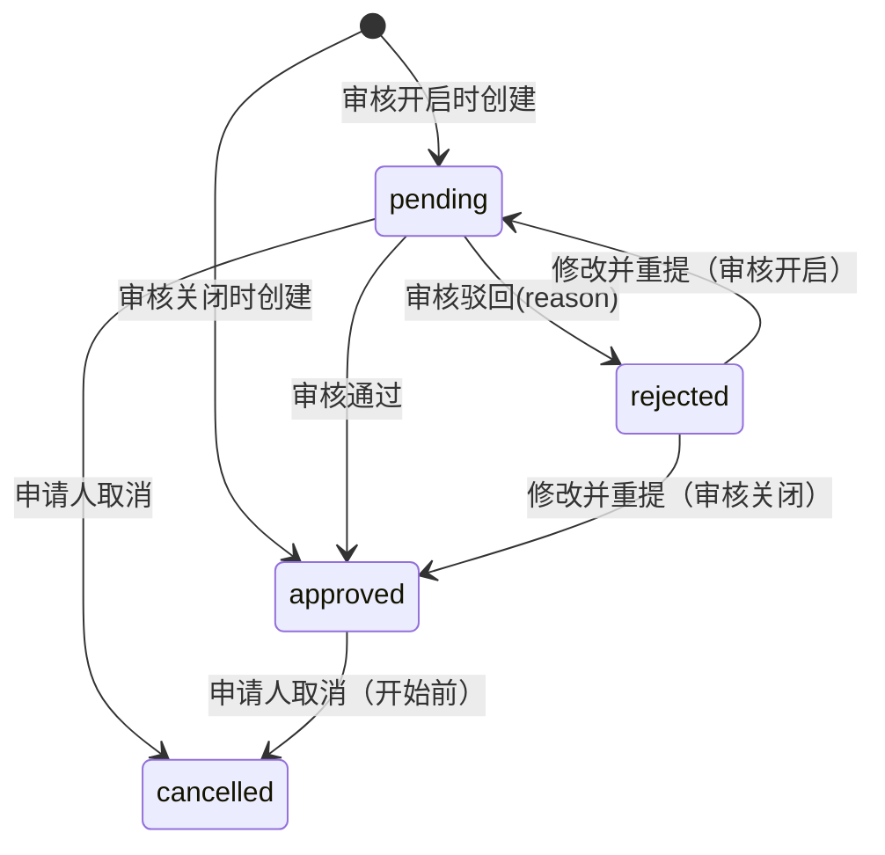

# 功能房预约模块需求说明（MVP 冻结版）

**状态**：✅ 已批准  
**版本**：v1.0（MVP）  
**最近更新**：2025-12-19

> 业务参考来源：`campus-hub-ruoyi/docs/requirements/功能房预约.md`（仅作为业务输入；本仓库按 `campus-hub-next` 架构与最佳实践重构落地）。  
> 目标：在不引入额外付费/复杂基础设施的前提下，落地一个“可运行、可测试、可部署”的功能房预约 MVP。

## 1. 目标与定位

- 为校内用户提供“按楼房/楼层浏览功能房 → 查看占用时间轴 → 在线提交预约”的闭环能力。
- 管理端提供：
  - 楼房/房间的基础管理与启停
  - 预约审核（可开关）
  - 模块级封禁（可到期/可永久）
- 提供两个榜单：房间累计被预约时长榜、用户累计预约时长榜（SQL 聚合）。

## 2. 范围（Scope）

### 2.1 MVP（本轮必须实现）

**空间管理（Console）**
- 楼房（Building）管理：增删改查、启用/停用
- 房间（Room）管理：增删改查、启用/停用；具备 `floorNo`（可为负数）

**预约流程（Portal + Console）**
- 时间：任意起止时间（可跨天）
- 创建预约：冲突校验、参与人校验（≥3 且必须为系统内真实用户）、最长使用时长限制（默认 72h，可配置）
- 审核开关（默认关闭）：
  - 关闭：创建后直接 `approved`
  - 开启：创建后进入 `pending`，由 `staff` 审核通过/驳回（驳回必填理由）
- 我的预约：列表/取消；被驳回后允许修改并重提

**时间轴（Portal）**
- 楼房/楼层纵览：所有房间甘特图（Gantt）展示占用（`approved` 实线 / `pending` 虚线）
- 房间详情：单房间时间轴（同口径）
- 默认不展示 `cancelled/rejected`（仅“我的预约”可见）

**榜单（Portal）**
- 房间累计被预约时长榜（7d/30d）
- 用户累计预约时长榜（7d/30d，以申请人为统计主体）

**封禁（Console）**
- 模块级封禁申请人（可设置到期时间或永久）
- 被封禁者仅禁止“创建新预约”，不影响既有预约

### 2.2 非目标（Out of Scope）

- 付费/支付、门禁/硬件联动
- 开放时间策略、节假日规则、重复性预约（周期预约）
- 外部日历订阅（iCal）与消息通知（站内信/邮件/短信）
- 复杂风控/反作弊（MVP 仅保留最小扩展点）

## 3. 角色与权限（RBAC）

说明：
- Portal 端：仅要求登录（`requireUser`），不强制权限码。
- Console 端：按权限码（RBAC）控制入口；后端强制校验，前端隐藏仅用于 UX。

### 3.1 角色（冻结）

- `user`：浏览与创建预约、查看/取消“我的预约”、驳回后修改并重提。
- `staff`：预约审核（通过/驳回）。
- `admin`：生活平台全量管理（功能房/公告/课程资源等），不含基础设施权限。
- `super_admin`：系统全量权限（通配）。

### 3.2 权限码（建议，module=facility）

> 约定：保持 3 段权限码（`campus:<module>:<op>`），并使用通配符提升可维护性（`campus:facility:*`、`campus:*:*`）。

- 管理端
  - `campus:facility:*`：功能房模块全量管理（楼房/房间/预约/封禁/配置/榜单）
  - `campus:facility:review`：预约审核（approve/reject）
  - `campus:facility:stats`：榜单查询（Console 可选；Portal 不强制）
  - `campus:facility:config`：模块配置（审核开关/最长时长）
  - `campus:facility:ban`：模块封禁（ban/revoke）
- 系统级（仅 super_admin）
  - `campus:*:*`：全系统通配权限

## 4. 关键用例（Use Cases）

- UC-F1：作为 user，我在 Portal 选择楼房/楼层，在甘特图上查看各房间占用，并发起预约。
- UC-F2：作为 user，我在房间详情页查看时间轴，并创建/调整预约时间段。
- UC-F3：作为 user，我在“我的预约”查看状态并在开始前取消；被驳回后修改并重提。
- UC-F4：作为 staff，我在 Console 查看待审核预约，执行通过/驳回（驳回必填理由）。
- UC-F5：作为 admin/super_admin，我在 Console 管理楼房/房间、启停；管理封禁；调整审核开关与最长时长。
- UC-F6：作为任意登录用户，我查看房间/用户两个榜单（7d/30d）。

## 5. 状态机与业务规则

### 5.1 预约状态机（冻结）

### 5.2 时间与时长规则（冻结）

- `startAt` 必须晚于当前时间（允许少量容差由实现决定，默认按严格 > now）。
- `endAt` 必须晚于 `startAt`（时长 > 0）。
- 最大时长：`endAt - startAt <= maxDurationHours`（默认 72h，可配置）。

### 5.3 冲突判定（冻结口径）

- 冲突定义：同一房间内任意两条（`pending/approved`）预约时间段重叠：
  - `existing.startAt < newEndAt` 且 `existing.endAt > newStartAt`
- 并发一致性：
  - 创建/改期/重提必须在事务内对房间行加锁（`FOR UPDATE`），避免并发“双成功”。

### 5.4 参与人规则（冻结）

- `participants` 必须为系统内真实用户（`profiles`），支持按姓名/学号搜索。
- 最小人数：≥3（含申请人）。
- 去重：同一预约内参与人不得重复。

### 5.5 房间启停规则（冻结）

- `enabled=false` 的房间不允许新增预约。
- 已存在的未来预约不强制取消（保留有效性；如需强制取消属于后续增强）。

### 5.6 封禁规则（冻结）

- 被封禁者禁止创建新预约（无论审核开关状态）。
- 封禁可设置到期时间（可空代表永久）。
- 封禁不影响既有预约与他人预约。

## 6. 时间轴 UI（页面结构与交互草图）

### 6.1 Portal：楼房/楼层纵览（甘特图）

- 顶部筛选：
  - 楼房选择
  - 楼层选择（含负数）
  - 起始日期（默认今天）
  - 窗口：7 天 / 30 天
- 主体：所有房间的甘特图纵览
  - 时间轴顶部显示日期刻度
  - `approved` 实线条，`pending` 虚线条
  - hover 显示时间段与状态；点击空白可快速发起预约（预填时间段）

### 6.2 Portal：房间详情时间轴

- 显示房间信息、容量/备注（如有）
- 时间轴展示占用；可发起预约

### 6.3 Portal：我的预约

- 列表：状态、房间、时间段、参与人数
- 操作：
  - 取消（开始前，且状态为 `pending/approved`）
  - 驳回后修改并重提

### 6.4 Portal：榜单

- 房间累计被预约时长榜（7d/30d）
- 用户累计预约时长榜（7d/30d）

## 7. 数据模型（概览）

> 命名以 `campus-hub-next` 为准，默认 uuid 主键、`timestamptz`、软删字段 `deleted_at`（如适用）。

- `facility_buildings`：楼房
- `facility_rooms`：房间（含楼房与楼层）
- `facility_reservations`：预约（申请人、起止时间、状态、审核/取消信息）
- `facility_reservation_participants`：参与人映射（申请人必须在内）
- `facility_bans`：模块封禁（可到期/可永久）
- `app_config`：模块配置（审核开关/最长时长）
