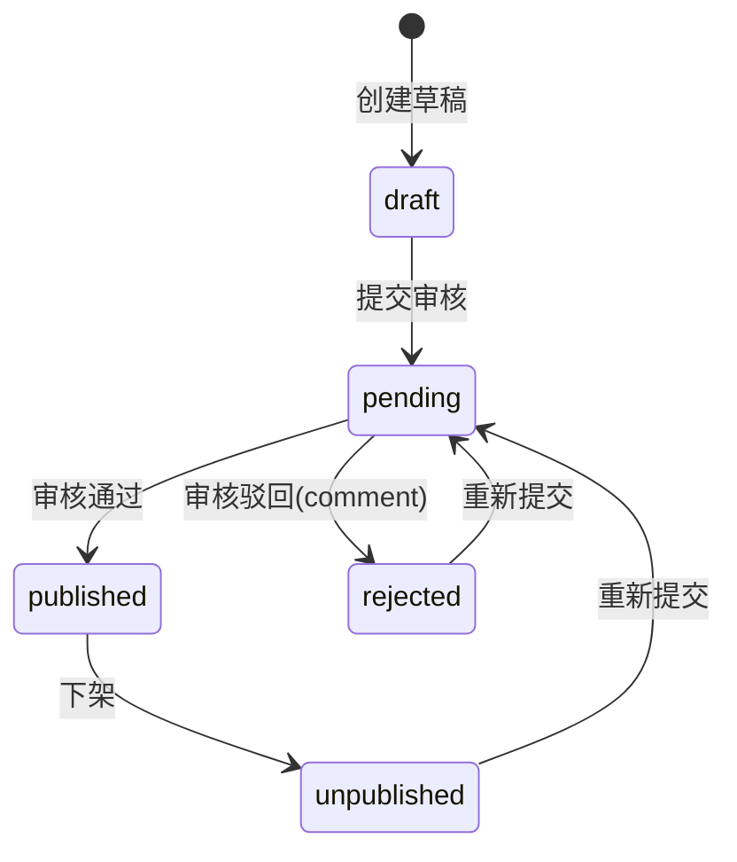

# 数字图书馆模块需求说明（MVP 冻结版）

**状态**：✅ 已批准  
**版本**：v1.0（MVP）  
**最近更新**：2025-12-20

> 业务参考来源：`campus-hub-ruoyi/docs/requirements/数字图书馆.md`（仅作为业务输入；本仓库按 `campus-hub-next` 架构与最佳实践重构落地）。  
> 本模块定位为“电子书/资料”的**下载型资源分享**：不做在线阅读/借阅，不做 DRM/付费；用户投稿、馆员审核发布，并提供收藏与榜单。

## 1. 目标与定位

- 面向校内用户提供“电子书/资料”的检索、查看详情、下载与收藏。
- 内容供给以“用户投稿”为主，`librarian` 负责审核、发布与下架维护。
- 统一通过 BFF（Next.js Route Handlers）完成鉴权、审核流转、下载计数与签名下载，避免客户端直连数据库或持有敏感凭据。

## 2. 范围（Scope）

### 2.1 MVP（本轮必须实现）

**Portal（登录即可）**
- 图书列表：搜索（标题/作者/ISBN/关键词）、分页、排序（最新/下载）
- 图书详情：展示元数据、可用格式与外链；按格式下载
- 收藏：收藏/取消收藏；我的收藏列表
- 投稿：创建草稿、编辑元数据、上传文件/添加外链、提交审核
- 我的投稿：查看状态、编辑/删除（仅 draft/rejected/unpublished）、对已发布条目下架（unpublish）
- 榜单：
  - 图书下载榜：总榜 + days 窗口（7/30/365）
  - 用户贡献榜：总榜 + days 窗口（7/30/365）

**Console（按权限）**
- 审核队列：待审列表、详情、通过/驳回（驳回需填写意见）
- 发布维护：已发布列表、详情、下架
- 管理列表：已驳回/已下架列表、详情
- 清理：硬删除（仅 `admin/super_admin`，删除数据库记录并清理存储对象）

### 2.2 非目标（Out of Scope）

- 在线阅读、借阅/库存、到期归还
- OPDS、第三方阅读器接入
- 版权/DRM、付费、复杂反作弊（仅保留最小扩展点）
- 全文检索（书内搜索）

## 3. 角色与权限（RBAC）

说明：
- Portal 端：仅要求登录（`requireUser`），不强制权限码。
- Console 端：按权限码控制入口与 API；后端强校验为唯一安全边界。

### 3.1 角色

- `user`：浏览、下载、收藏、投稿与管理“我的投稿”。
- `librarian`：审核、发布、下架维护（数字图书馆运营角色）。
- `admin` / `super_admin`：拥有 `librarian` 能力；额外拥有硬删除与全量管理能力。

### 3.2 权限码（建议，module=library）

- `campus:library:*`：数字图书馆（全量）
- `campus:library:list`：列表/查询（管理端）
- `campus:library:read`：详情查看（管理端）
- `campus:library:review`：审核（通过/驳回）
- `campus:library:offline`：下架
- `campus:library:delete`：硬删除（删库+清理存储对象，仅 admin/super_admin）

## 4. 关键用例（Use Cases）

- UC-L1：作为 user，在 Portal 搜索图书并进入详情下载某一格式，系统自动计数并写入下载事件。
- UC-L2：作为 user，在详情页收藏/取消收藏某本书，并在“我的收藏”中查看。
- UC-L3：作为 user，在“新建投稿”填写 ISBN/标题/作者（简介/关键词可选），上传一个或多个格式文件/添加外链，并提交审核。
- UC-L4：作为 librarian，在 `/console/library/pending` 审核待审条目：通过发布/驳回（填写意见）。
- UC-L5：作为 librarian，对已发布条目下架维护；作为 admin/super_admin 可执行硬删除与清理存储对象。
- UC-L6：作为任意登录用户，在榜单页查看“下载榜/贡献榜”，支持总榜与 days=7/30/365 窗口。

## 5. 状态机与业务规则（冻结）

### 5.1 状态机

状态：`draft`（草稿）/ `pending`（待审）/ `published`（已发布）/ `rejected`（已驳回）/ `unpublished`（已下架）

### 5.2 编辑与删除策略

- 可编辑状态：`draft/rejected/unpublished`
- `pending`：作者不允许修改（避免“提交后内容变化”导致审核不一致）
- `published`：作者不允许直接修改；如需修订，需先下架到 `unpublished`，再编辑并重新提交审核
- 删除：
  - Portal（作者）：仅允许删除 `draft/rejected/unpublished`
  - Console（admin/super_admin）：允许硬删除（删库+清理存储对象）
  - `librarian`：不允许硬删除，仅允许审核/下架维护

> 口径：任何“对外可见内容”的修改都必须重新走审核（提交到 `pending`）。

### 5.3 ISBN-13 规范化与唯一性

- ISBN-13 必填且全局唯一：
  - 输入允许包含空格/连字符；入库前规范化为 **13 位数字字符串**
  - 校验规则：
    - 必须为 13 位数字
    - 必须通过 ISBN-13 校验位算法
  - 若 ISBN 已存在（任意状态），创建/修改必须提示冲突并阻止提交

### 5.4 资产模型（多格式 + 外链）

- 一本书可包含多个资产（assets）：
  - 文件资产：`pdf/epub/mobi/zip`（单文件 ≤ **100MB**）
  - 外链资产：URL（由后端做规范化与去重）
- 约束：
  - 同一本书同一文件格式最多 1 份
  - 外链在同一本书维度按“规范化 URL”去重

### 5.5 下载计数与榜单

- 所有下载必须走受控下载接口：
  - 写入下载事件（append-only）用于审计与 days 窗口统计
  - 同时冗余维护 `download_count/last_download_at` 加速排序
- days 窗口：仅支持 7/30/365（避免任意窗口导致缓存/索引不可控）
- MVP 不做复杂防刷（后续可按 userId/ip 做最小间隔或合并计数）

### 5.6 收藏（Favorites）

- 幂等：同一用户对同一本书仅能收藏一次（复合唯一约束）
- 取消收藏为幂等删除

## 6. 存储与安全（100MB 文件最佳实践）

### 6.1 上传：客户端直传 + 服务端签名

- bucket：`library-books`（private）
- 流程（概览）：
  1) 客户端创建图书草稿（获得 `bookId`）
  2) 客户端请求服务端生成“签名上传 URL”（校验格式/大小 ≤ 100MB）
  3) 客户端使用 signed upload url 直传 Supabase Storage
  4) 提交审核（服务端检查至少存在 1 个资产）

### 6.2 下载：短时签名 URL + 302

- 文件资产：后端生成短时 signed url 并 302 重定向，同时写入下载事件/更新计数
- 外链资产：后端 302 到规范化 URL，同时写入下载事件/更新计数

### 6.3 文件校验（冻结）

- 仅允许扩展名：`.pdf/.epub/.mobi/.zip`
- 大小：`0 < size <= 100MB`
- MIME 不作为唯一依据（不同浏览器可能不可靠），以扩展名 + 服务端规则为准

## 7. 数据模型（概览）

> 命名以 `campus-hub-next` 为准，默认 uuid 主键、`timestamptz`、软删字段 `deleted_at`。

- `library_books`：图书主体（ISBN、标题、作者、简介、关键词、状态/审核字段、统计、上传者与审计字段）
- `library_book_assets`：图书资产（文件/外链；文件格式、对象键、大小；外链规范化 URL）
- `library_book_favorites`：收藏关系（用户-图书，唯一约束）
- `library_book_download_events`：下载事件（审计与 days 统计溯源）

## 8. 页面信息架构（IA）

### 8.1 Portal
- `/library`：图书列表（搜索/分页/排序、入口：我的投稿/我的收藏/榜单/新建投稿）
- `/library/[id]`：详情（资产下载、收藏）
- `/library/me`：我的投稿
- `/library/me/new`：新建投稿
- `/library/me/[id]`：投稿详情/编辑/提交
- `/library/favorites`：我的收藏
- `/library/leaderboard`：下载榜/贡献榜（总榜 + days=7/30/365）

### 8.2 Console
- `/console/library/pending`：待审核（通过/驳回）
- `/console/library/published`：已发布（下架）
- `/console/library/rejected`：已驳回
- `/console/library/unpublished`：已下架
- `/console/library/[id]`：详情

## 9. DoD（本模块完成标准）

- DB：迁移脚本可在 Supabase 执行并验证结构与约束。
- API：实现并覆盖成功/参数错误/权限错误等基本场景（Portal/Me/Console）。
- Portal：列表/详情/下载/收藏/我的投稿/我的收藏/榜单流程可操作，具备加载/错误提示。
- Console：审核/下架/硬删除流程可操作；关键写操作写入审计日志。
- 测试：至少覆盖 ISBN-13 规范化与校验、格式与大小白名单。

## 10. 开放问题（后续迭代）

- 是否引入“封面图”（手工上传 vs 从 PDF 抽取）？
- 是否引入“标签/系列/语言”等更强的检索维度（并配合更合适的索引/全文检索）？

## 11. 调研摘要（参考，不改变冻结范围）

本小节用于沉淀“现代数字图书馆/电子书库”产品的常见体验模式与实现取舍，作为后续迭代的设计输入；**不影响本文件已冻结的 MVP 范围与非目标**。

### 11.1 体验模式（对标思路）

- **搜索优先**：在列表页提供单一主搜索框，支持 ISBN/标题/作者/关键词的快速检索；筛选项保持少而精（格式/排序/分页），避免把复杂过滤堆到首屏。
- **强信息密度的列表卡片**：标题 + 作者 + 下载数 + 资产格式（PDF/EPUB/MOBI/ZIP）+ 外链标记；让用户无需进入详情就能判断是否值得点开。
- **详情页以“可下载资产”为主**：以资产列表驱动下载动作（文件/外链），并保持按钮语义明确（下载/打开外链/直达）。
- **收藏/书架是二级入口**：收藏提供“稍后再看/常用资源”的轻量组织方式（无需引入复杂书单/分类即可提升回访效率）。
- **审核与运营操作要快**：管理端强调“队列视角”（pending 队列、已发布、已驳回、已下架），操作收敛为通过/驳回/下架/硬删除，并把“原因/备注”写入审计，便于追溯。

### 11.2 工程取舍（与本平台架构对齐）

- **元数据为核心、全文为增量**：多数成熟系统会逐步走向更强的元数据与过滤能力（标签/语言/出版信息/系列等），但 MVP 先用“元数据检索 + 索引优化”解决 80% 场景，避免过早引入全文索引与解析链路。
- **文件安全与可控下载**：下载行为通常需要统一入口以完成审计/统计/权限控制；本项目采用“服务端签名 URL + 302 重定向”，在 private bucket 下保持最小权限暴露。
- **媒体分析/封面生成可作为后续能力**：成熟系统常提供“从文件抽取封面/解析 metadata”的流水线；本项目暂不做在线阅读与解析，仅在开放问题中保留封面方向。

### 11.3 参考资料（调研来源）

- ANX Calibre Manager（现代、移动优先的书库管理前端）：https://github.com/ptbsare/anx-calibre-manager
- Komga（媒体分析/元数据刷新/封面生成等能力的实现思路）：https://github.com/gotson/komga
- Kavita Wiki（丰富的元数据过滤与“智能过滤器”产品形态）：https://wiki.kavitareader.com/guides/features/filtering
