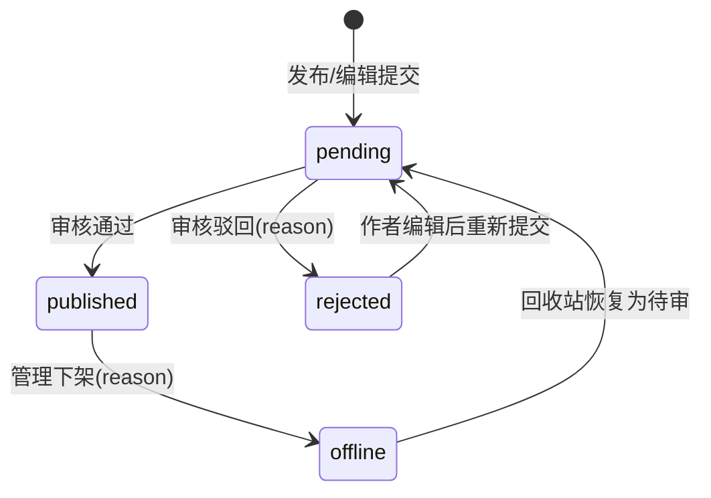

# 失物招领模块需求说明（MVP 冻结版）

**状态**：✅ 已批准  
**版本**：v1.0（MVP）  
**最近更新**：2025-12-21

> 业务参考来源：`campus-hub-ruoyi/docs/requirements/失物招领.md`（仅作为业务输入；本仓库按 `campus-hub-next` 架构与最佳实践重构落地）。  
> 命名约定：全链路统一使用 `lostfound`（文档/路由/API/权限 module），避免出现其他历史别名造成歧义。

## 1. 目标与定位

- 为校内登录用户提供“失物/拾物信息发布 → 管理审核 → 公开展示 → 标记已解决/下架”的最小闭环。
- 设计重点：
  - 默认审核（降低垃圾信息与纠纷风险）
  - 隐私优先（不做站内撮合，不对外暴露平台侧的用户联系方式；仅展示发布者自填 `contactInfo`）
  - 敏感物品（证件/银行卡等）差异化口径（见 5.6）

## 2. 范围（Scope）

### 2.1 MVP（本轮必须实现）

**Portal（登录用户）**
- 列表：仅展示 `published`；默认隐藏“已解决”；支持筛选（类型/是否已解决/时间范围/关键词）与分页。
- 详情：展示正文与图片；展示发布者自填 `contactInfo`（含隐私提示文案）。
- 发布：创建 `lost|found` 条目，填写标题/正文/地点/时间（可选）/联系方式（可选）并上传图片（≤9）。
- 编辑：仅作者本人，且未解决；编辑后重新进入 `pending`（重新审核）。
- 删除：仅作者本人，软删（不做硬删除）。
- 标记已解决：仅作者本人，且状态为 `published`；标记后不可回退。
- 我的发布：仅本人可见，包含全部状态（`pending/published/rejected/offline`），可查看驳回/下架原因并执行对应操作（编辑/删除/解决）。

**Console（管理端）**
- 待审核：列表与详情，支持通过/驳回（驳回必填理由）。
- 已发布：列表与详情，支持下架（必填理由）。
- 回收站：包含 `rejected/offline`，支持恢复为 `pending`；支持软删（仅用于清理明显违规/重复数据）。

### 2.2 非目标（Out of Scope）

- 认领申请/审核、站内私信/撮合、线下交接跟踪。
- 自动匹配（图像识别/文本相似度）、自动归档（按时间自动关闭/下架）。
- 通知系统（站内信/邮件/短信/Webhook）、复杂风控（频控/敏感词联动/反作弊）——仅保留最小扩展点。

## 3. 角色与权限（RBAC）

说明：
- Portal：仅要求登录（`requirePortalUser`），不强制权限码。
- Console：按权限码（RBAC）控制入口；后端强制校验，前端隐藏仅用于 UX。

### 3.1 角色（冻结）

- `user`：发布、编辑/删除“我的条目”，标记已解决；浏览已发布条目。
- `staff`：审核、下架、回收站恢复。
- `admin` / `super_admin`：跨模块全量管理（通配）。

### 3.2 权限码（建议，module=lostfound）

- 管理端
  - `campus:lostfound:*`：失物招领模块全量管理（列表/审核/下架/恢复/软删）
  - `campus:lostfound:list`：列表与详情查看
  - `campus:lostfound:review`：审核（approve/reject）
  - `campus:lostfound:offline`：下架
  - `campus:lostfound:restore`：恢复为待审
  - `campus:lostfound:delete`：软删清理（仅 admin/super_admin 可授予）
- 系统级（仅 super_admin）
  - `campus:*:*`：全系统通配权限

## 4. 关键用例（Use Cases）

- UC-LF1：作为 user，我在 Portal 发布失物/拾物信息并上传图片，以便他人看到并联系我。
- UC-LF2：作为 user，我在列表页筛选与搜索，查看与我相关的失物/拾物信息。
- UC-LF3：作为 user，我编辑我发布的条目并重新提交审核，以便修正信息。
- UC-LF4：作为 user，我将已找回/已处理的条目标记为“已解决”，以减少信息干扰。
- UC-LF5：作为 staff，我在 Console 审核待审条目并通过/驳回（含理由），以保障信息合规有效。
- UC-LF6：作为 staff，我对已发布条目执行下架（含理由）并可在回收站恢复，以处理违规/纠纷/过期信息。

## 5. 状态机与业务规则

### 5.1 条目类型（冻结）

- `type`：`lost`（丢失）/ `found`（拾到）

### 5.2 条目状态机（冻结）

### 5.3 已解决标记（冻结）

- `solved` 为独立标记（不改变 `status` 取值），语义为“发布者已确认结束处理”。
- 规则：
  - 仅作者本人可标记；
  - 仅 `published` 可标记；
  - 标记后不可撤销；
  - Portal 列表默认隐藏 `solved=true`，可筛选展示。

### 5.4 可见性与权限边界（冻结）

- Portal 列表/详情：仅登录可访问。
- 可见范围：
  - 任意登录用户仅可见 `published` 条目（`deleted` 的条目对所有人不可见）。
  - 作者本人在“我的发布”可见自己全部状态条目。
  - Console 端按权限码可见待审/已发布/回收站数据。

### 5.5 字段与校验规则（冻结）

- `title`：2~50 字
- `content`：5~2000 字
- `location`：可选，≤100 字
- `occurredAt`：可选（丢失/拾到时间）
- `contactInfo`：可选，≤50 字；Portal 端提供提示：请勿填写身份证号/银行卡号/详细住址等敏感信息
- 图片：
  - 数量：≤9
  - 格式：`jpg/jpeg/png/webp`
  - 大小：≤2MB/张（前端与后端二次校验）
  - 存储：通过 `StorageAdapter`；使用 private bucket（`lostfound`），仅通过 signedUrl 访问；表中保存 `bucket/key`（避免直接依赖云厂商 URL 结构）

### 5.6 敏感物品策略（冻结）

为降低隐私与纠纷风险，以下类别视为“敏感物品”（可扩展）：
- 证件：身份证/护照/学生证/驾驶证等
- 金融：银行卡/信用卡/社保卡等
- 含可识别个人信息的物品（如写有完整姓名+手机号/地址的资料）

规则：
- 发布内容不得包含证件号/银行卡号/完整姓名+手机号等可识别信息。
- 建议流程：拾到敏感物品应优先上交学校指定地点（如保卫处/服务台），平台仅发布“已上交地点/时间/物品大类”信息。
- 违规处理：管理端可驳回或下架，并在理由中提示按规定上交。

## 6. 页面结构与交互草图（MVP）

### 6.1 Portal：`/lostfound`（列表）

- 顶部筛选：
  - 类型：全部 / 丢失 / 拾到
  - 状态：默认隐藏已解决（checkbox：显示已解决）
  - 时间范围（可选）：起止日期
  - 关键词：标题/正文模糊匹配
- 列表项：类型标签、标题、地点、时间、发布时间、是否已解决
- 操作：
  - 发布入口（跳转到发布页）
  - 点击进入详情

### 6.2 Portal：发布/编辑（建议路由：`/lostfound/new`、`/lostfound/:id/edit`）

- 表单字段：类型、标题、正文、地点、时间、联系方式、图片九宫格上传
- 校验：按 5.5；提交后进入 `pending` 并提示“等待审核”

### 6.3 Portal：我的发布（建议路由：`/lostfound/me`）

- Tab/筛选：全部 / 待审 / 已发布 / 驳回 / 已下架
- 展示：状态、原因（驳回/下架）、是否已解决
- 操作：编辑（未解决）、删除、标记已解决（仅已发布）

### 6.4 Console：`/console/lostfound`（管理）

建议以 Tab 组织：
- 待审核（pending）：通过/驳回（必填理由）
- 已发布（published）：下架（必填理由）
- 回收站（rejected/offline）：恢复为待审、软删

## 7. 数据模型（概览）

> 命名以 `campus-hub-next` 为准：默认 uuid 主键、`timestamptz`、软删字段 `deleted_at`。

- `lostfound_items`
  - `id` uuid
  - `type` (`lost|found`)
  - `title` varchar(50)
  - `content` text
  - `location` varchar(100) null
  - `occurred_at` timestamptz null
  - `contact_info` varchar(50) null
  - `status` (`pending|published|rejected|offline`)
  - `publish_at` timestamptz null
  - `reject_reason` text null
  - `offline_reason` text null
  - `solved_at` timestamptz null
  - `created_by` uuid
  - `created_at/updated_at/deleted_at`
- `lostfound_item_images`
  - `id` uuid
  - `item_id` uuid (FK → `lostfound_items.id`)
  - `storage_key` text
  - `sort_no` int
  - `created_at/updated_at/deleted_at`

索引建议（MVP）：
- `lostfound_items(status, publish_at desc)`
- `lostfound_items(created_by, created_at desc)`
- `lostfound_item_images(item_id, sort_no)`

## 8. 后续增强（不在本轮）

- 浏览量：如需要再引入“浏览事件表”（避免在行上直接累计计数，便于审计与去重）。
- 自动归档/到期下架策略（按发布时长/学校规则）
- 举报与申诉、敏感词/频控
- 认领流程（证据提交、审核、线下交接指引）与通知能力
