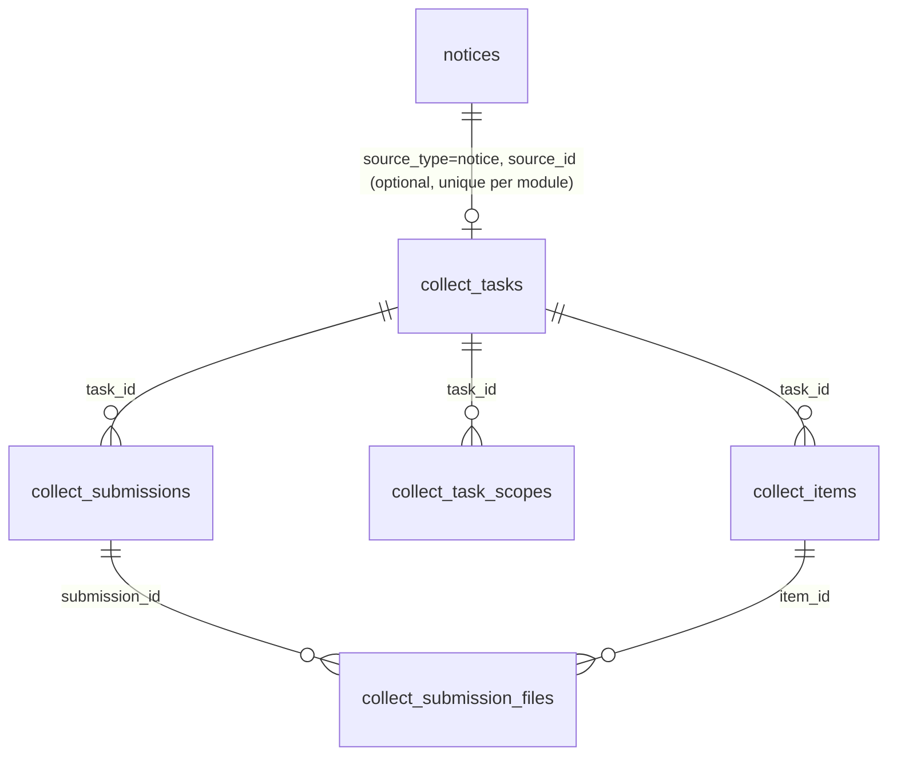
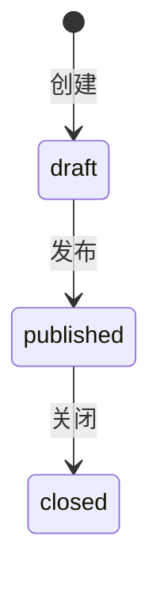

# 材料收集模块需求说明（MVP 冻结版）

**状态**：✅ 已批准  
**版本**：v1.0（MVP）  
**最近更新**：2025-12-20

> 定位：将“奖学金/留学交流等申请材料”的收集与管理从 QQ/微信/邮箱迁移到系统内，并提供强 Console 管理能力（处理、检索、归档、导出 ZIP）。

> 实现口径：材料收集作为「收集型场景」的首个试点，底座采用 `docs/requirements/collect-engine.md` 定义的“收集引擎（Collect Engine）”。对外 API 与交互仍保持 `materials` 领域命名（便于理解），底层数据结构以 `collect_*` 表族承载（module=`material`）。

## 1. 目标与定位

- 面向学生：在 Portal 内按任务提交材料、查看处理结果、按需撤回并重新提交。
- 面向管理端：在 Console 内创建材料收集任务、配置材料项与模板、按提交维度处理/分配、批量操作、归档与导出 ZIP。
- 模块独立存在，但最常见与通知公告 1:1 关联并双向跳转；未来可与其他模块复用关联。

## 2. 范围（Scope）

### 2.1 MVP（本轮必须实现）

**任务（Material）**
- 状态：草稿（draft）→ 已发布（published）→ 已关闭（closed）
- 支持归档（archived）：归档后仅用于查询/导出，不再出现在 Portal 列表。
- 截止时间 `dueAt`（硬截止）：`now > dueAt` 时禁止上传/提交（不做提醒、不自动关闭）。
- 支持关联通知公告（1:1，可选）：  
  - 若关联：任务可见范围继承通知公告（role/department/position OR）。  
  - 若不关联：任务自身配置可见范围（`visibleAll + scopes`）。

**材料项（Item）**
- 字段：标题、说明（可选）、是否必交、排序。
- 模板文件：每个材料项可提供 0~1 个模板文件供下载。

**提交（Submission）**
- 同一用户对同一任务最多 1 份提交（覆盖式，不保留版本历史）。
- 用户可撤回：撤回后立即物理删除该提交下的所有文件对象；保留提交记录与审计。
- 重新提交：撤回后可再次提交；或在未撤回情况下更新文件后再次提交（覆盖式）。

**处理（Console）**
- 处理状态（冻结）：`pending`（待处理）/ `complete`（已收齐）/ `need_more`（需补）/ `approved`（通过）/ `rejected`（驳回）
- 支持分配经办人（assignee）与批量处理（批量指派给我、批量改状态、批量填写“需补/驳回原因”）。
- 检索维度（冻结）：学号、姓名、提交时间范围、部门、状态、是否缺材料。

**导出（Console）**
- 导出 ZIP（按任务维度）：支持按筛选条件导出；目录结构固定为：
  - `学号-姓名/材料项名/原文件名`
  - 根目录附 `manifest.csv`（用于汇总与检索）
- 导出范围：默认仅导出 `submittedAt != null`；可选包含未提交（例如仅上传未提交的情况）。

### 2.2 非目标（Out of Scope）

- 复杂审批流引擎（节点/会签/抄送等）
- 版本历史、差异对比
- 自动提醒/站内信/邮件通知
- 全量异步导出任务（job）与长期缓存（MVP 先做同步导出 + 体量上限兜底）

## 3. 角色与权限（RBAC）

说明：
- Portal：仅要求登录（`requireUser`），不强制权限码。
- Console：按权限码控制入口；并包含“资源级授权/数据范围”约束（默认只能操作自己创建的任务；`campus:material:manage` 可在 DataScope 范围内操作他人创建的任务与提交）。

### 3.1 权限码（module=material）

- `campus:material:list`：任务列表/查询（Console）
- `campus:material:read`：任务详情/提交列表（Console）
- `campus:material:create`：创建任务（草稿）
- `campus:material:update`：编辑任务（草稿）
- `campus:material:delete`：删除任务（软删）
- `campus:material:publish`：发布
- `campus:material:close`：关闭
- `campus:material:archive`：归档
- `campus:material:process`：处理提交（分配/改状态/批量）
- `campus:material:export`：导出 ZIP
- `campus:material:manage`：全量管理（可操作他人创建的任务与提交；但不越过 DataScope）

## 4. 领域模型（概览）

### 4.1 实体与关系

- 领域实体仍以 “Material/Item/Submission/File” 表达，但底层由收集引擎承载：
  - `collect_tasks`（module=`material`）：材料任务（可选关联通知公告）
  - `collect_items`：材料项（kind=`file`，可挂 0~1 模板文件）
  - `collect_submissions`：用户提交（一人一份）
  - `collect_submission_files`：提交文件（归属某材料项）
  - `collect_task_scopes`：任务自身可见范围（仅在未关联通知时生效）

### 4.2 ER 图（简化）

## 5. 状态机与关键规则

### 5.1 任务状态（冻结）

### 5.2 提交与撤回（冻结）
- 提交：校验必交材料项均已上传至少 1 个文件；写入 `submittedAt`；处理状态重置为 `pending`。
- 撤回：仅允许本人撤回；撤回后立即物理删除文件对象，并清空文件记录；写入 `withdrawnAt`。

### 5.2.1 截止时间（冻结）
- 发布要求 `dueAt` 非空且晚于当前时间。
- `now > dueAt`：禁止上传/删除文件、禁止提交（硬截止）。
- 发布后允许修改 `dueAt`（仅截止；结构仍锁定）。

### 5.3 缺材料判定（冻结）
- 以“必交材料项 required=true”为基准：若任一必交项文件数为 0，则 `missingRequired=true`。
- Console 支持按 `missingRequired` 过滤。

### 5.4 可见范围继承（冻结）
- 若 `noticeId` 存在：任务可见范围继承通知公告（role/department/position OR），任务自身 `visibleAll/scopes` 不生效。
- 若 `noticeId` 为空：任务使用自身 `visibleAll/scopes`。

### 5.5 文件安全（冻结）
- 提交文件与模板文件默认敏感：使用私有桶 + 鉴权后签名下载（短期 URL）。
- ZIP 导出需做路径安全处理（禁止 `../` 等路径穿越），并对 `manifest.csv` 做 CSV 注入防护。

## 6. 页面结构与交互草图（MVP）

### 6.1 Portal
- `/materials`：任务列表（仅显示可见且未归档；状态包含 `published/closed`）
- `/materials/:id`：任务详情
  - 展示材料项、模板下载、上传与提交/撤回
  - 展示处理状态与“需补/驳回原因”
  - 若关联通知公告：提供“查看关联通知”入口

### 6.2 Console
- `/console/materials`：任务列表（Tabs：已发布/草稿/已关闭/已归档；支持搜索与分页；列表内弹窗完成新建/编辑）
  - `?dialog=material-create[&noticeId=<noticeId>]`：新建任务草稿（可选带 `noticeId`，则继承通知可见范围）
  - `?dialog=material-edit&id=<materialId>`：编辑任务（草稿阶段可编辑材料项；发布后锁定材料项结构）
  - 兼容：`/console/materials/new`、`/console/materials/:id/edit` 会重定向到上述 dialog
- `/console/materials/:id/submissions`：提交管理
  - 强筛选（学号/姓名/部门/时间/状态/缺材料）
  - 批量操作（指派给我、改状态、填写原因）
- `/console/materials/:id/export`：导出 ZIP（按筛选条件导出）
