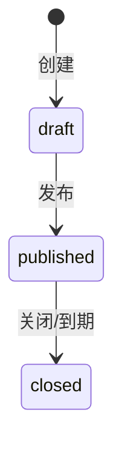

# 问卷模块需求说明（MVP 冻结版）

**状态**：✅ 已批准  
**实现状态**：✅ 已完成（MVP）  
**版本**：v1.0（MVP）  
**最近更新**：2025-12-20

> 业务参考来源：`campus-hub-ruoyi/docs/requirements/问卷.md`（仅作为业务输入；本仓库按 `campus-hub-next` 架构与最佳实践重构落地）。  
> 目标：在不引入额外付费/重型基础设施的前提下，落地一个“可运行、可测试、可部署”的问卷 MVP，并在管理端支持 AI 总结（Markdown 输出、不落库）。

## 1. 目标与定位

- 面向校内用户提供“问卷列表 → 按分节整页填写 → 提交/截止前修改覆盖 → 截止后查看本人答卷”的闭环能力。
- 管理端提供“草稿编辑 → 发布 → 统计 → CSV 导出 → AI 总结（Markdown）”。
- 与通知公告保持一致的“可见范围”模型（`visibleAll + role/department/position OR`），为未来投票等模块复用。

## 2. 范围（Scope）

### 2.1 MVP（本轮必须实现）

**题型（冻结）**
- 文本题（`text`）
- 单选题（`single`）
- 多选题（`multi`）
- 评分题（`rating`，固定 1-5）

**Portal（填写端）**
- 必须登录
- 列表：展示可见问卷；显示未开始/进行中/已结束；标记“匿名答卷”
- 详情：整页/分节式填写；必填校验；截止前可重复提交覆盖
- 已结束（closed）：不可提交，但允许查看本人答卷

**Console（管理端）**
- 问卷列表：草稿/已发布/已结束 tabs；支持搜索与分页
- 创建草稿：设置标题/起止时间/匿名/可见范围/说明（Markdown）
- 草稿编辑：分节/题目/选项的列表编辑、上下移动排序、预览
- 发布：草稿 → 已发布（发布后结构锁定）
- 关闭：已发布 → 已结束（也允许“到期视为结束”的有效状态）
- 结果页：选择题分布、评分均值与分布、文本样本（抽样）
- 导出：CSV（匿名问卷不包含答题人身份列）
- AI 总结：仅已结束问卷可生成；输出 Markdown；不落库；开放题原文按样本抽样发送（样本会做基础脱敏：邮箱/手机号/身份证号）

### 2.2 非目标（Out of Scope）

- 跳题/显示逻辑（条件题）
- 文件上传、日期/时间、矩阵题、复杂评分（NPS 等）
- 多语言、复杂主题自定义、拖拽式编辑器（后续迭代）
- 自动提醒、站内信/邮件通知、结果公示页
- 反作弊（MVP 不做）

## 3. 角色与权限（RBAC）

说明：
- Portal：仅要求登录（`requireUser`），不强制权限码。
- Console：按权限码控制入口；后端强制校验。

### 3.1 角色（冻结）
- `user`：浏览可见问卷、填写、截止前修改、截止后查看本人答卷。
- `staff`：创建/编辑草稿、发布、关闭、查看结果、导出、AI 总结（默认仅操作自己创建的问卷；可通过数据范围配置扩展）。
- `admin`：问卷模块全量（含删除等）。
- `super_admin`：系统全量通配。

### 3.2 权限码（建议，module=survey）

- `campus:survey:*`：问卷模块全量
- `campus:survey:list`：列表/查询（管理端）
- `campus:survey:read`：详情/结果查看（管理端）
- `campus:survey:create`：创建草稿
- `campus:survey:update`：编辑草稿（结构）
- `campus:survey:publish`：发布
- `campus:survey:close`：关闭
- `campus:survey:export`：导出 CSV
- `campus:survey:ai_summary`：AI 总结（Markdown）
- `campus:survey:delete`：删除（软删）

## 4. 状态机与时间规则

### 4.1 状态机（冻结）

### 4.2 时间规则（冻结）

- `endAt > startAt`
- Portal 可提交条件：
  - 有效状态为 `published`，且 `now ∈ [startAt, endAt)`
- 到期口径：
  - `now >= endAt` 视为“有效状态 closed”（不可提交）

## 5. 可见范围与匿名策略

### 5.1 可见范围（冻结）

- `visibleAll=true`：全员可见
- `visibleAll=false`：至少 1 条 scope；用户命中 role/department/position 任一即可见（OR 逻辑）
  - `department` 命中口径为“部门及子部门”（依赖部门闭包表）

### 5.2 匿名答卷（冻结）

- 匿名问卷仍要求登录；DB 仍保存 `userId` 用于 Portal “查看本人答卷/覆盖提交”。
- 匿名仅影响管理端输出：
  - 结果页不展示答题人身份
  - CSV 导出不包含“学号/姓名”等身份列
  - AI 总结不包含身份字段；开放题原文仅发送抽样文本（基础脱敏：邮箱/手机号/身份证号；不做通用数字脱敏）

## 6. 幂等与数据一致性

- 答卷约束：同一用户对同一问卷最多 1 份（`surveyId + userId` 唯一）。
- 截止前重复提交覆盖：新提交会替换旧答案明细。
- 发布后结构锁定：避免“题目变更导致历史答卷语义不一致”。
