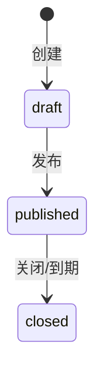

# 投票模块需求说明（MVP 冻结版）

**状态**：✅ 已批准  
**实现状态**：✅ 已实现（已迁移落地，方案 2A）  
**版本**：v1.0（MVP）  
**最近更新**：2025-12-21

> 目标：在 `campus-hub-next` 架构下实现一个“优雅、用户友好、可运行/可测试/可部署”的投票模块。  
> 约束：不引入额外付费基础设施；复用现有可见范围/数据范围/审计能力；业务逻辑集中在 Service 层。

## 1. 目标与定位

- 面向校内用户提供“投票列表 → 详情参与 → 截止前覆盖提交 → 结束后查看结果”的闭环。
- 管理端提供“草稿编辑 → 发布 → 关闭 → 延期（重新开放） → 置顶 → 归档”的闭环。
- 可见范围模型与通知公告/问卷一致（`visibleAll + role/department/position OR`），为未来“报名/评选/活动投票”等场景复用。

## 2. 范围（Scope）

### 2.1 MVP（本轮必须实现）

**题型（冻结）**
- 单选题（`single`）
- 多选题（`multi`），支持 `maxChoices`（最多选择 N 项）

**Portal（参与端）**
- 必须登录
- 公共列表：展示“可见且未归档”的投票；显示未开始/进行中/已结束；标记“匿名投票”；标记“已投/未投”；置顶优先
- 我的投票：只展示我参与过的投票（包含归档）
- 详情：显示投票说明（Markdown）与题目；截止前可提交/覆盖；结束后可查看结果（聚合统计）

**Console（管理端）**
- 列表：按状态（草稿/已发布/已结束）筛选；支持搜索/分页；支持“仅我创建/已归档”过滤；显示置顶/匿名/可见范围
- 创建草稿：设置标题/起止时间/匿名/可见范围/说明（Markdown）；默认创建 1 道题与 2 个候选项（可编辑）
- 草稿编辑：题目/候选项/`maxChoices`/必答/排序编辑（发布后结构锁定）
- 发布：草稿 → 已发布（发布后结构锁定）
- 关闭：已发布 → 已结束（可手动提前结束）
- 延期：允许到期后延期；`endAt` 只能延长；若当前为 `closed`，延期后重新开放为 `published`
- 置顶：仅“未结束且已发布”的投票允许置顶；结束后自动取消置顶
- 归档：仅“已结束（effective closed）”允许归档；归档后从 Portal 公共列表隐藏，但在“我的投票”可见
- 结果页：展示每题候选项票数与占比、总参与人数

### 2.2 非目标（Out of Scope）

- 文件上传题、文本题、评分题、跳题逻辑、复杂分组/分节
- 未投/未参与名单、实名投票人员明细导出
- 结果公示页（独立 URL）与 AI 总结
- 反作弊（同设备/同 IP 等）

## 3. 角色与权限（RBAC）

说明：
- Portal：仅要求登录（`requireUser/requirePortalUser`），不强制权限码。
- Console：按权限码控制入口；后端强制校验；数据范围（DataScope）默认限制“仅可操作 DataScope 内的数据”。

### 3.1 角色（冻结）
- `user`：浏览可见投票、参与投票、截止前覆盖、结束后查看结果。
- `staff`：创建/编辑草稿、发布、关闭、延期、置顶、归档、查看结果（默认仅操作自己创建的投票；可通过数据范围配置扩展）。
- `admin`：投票模块全量（含数据范围覆盖）。
- `super_admin`：系统全量通配。

### 3.2 权限码（module=vote）

- `campus:vote:*`：投票（全量）
- `campus:vote:list`：投票列表/查询（管理端）
- `campus:vote:read`：投票详情/结果查看（管理端）
- `campus:vote:create`：创建投票（草稿）
- `campus:vote:update`：编辑投票（草稿结构）
- `campus:vote:publish`：发布投票
- `campus:vote:close`：关闭投票
- `campus:vote:extend`：延期（修改 endAt，可重新开放）
- `campus:vote:pin`：置顶/取消置顶
- `campus:vote:archive`：归档

## 4. 状态机与时间规则

### 4.1 状态机（冻结）

归档（`archivedAt`）是独立维度：归档后仅用于查询与结果查看，不可提交与变更配置。

### 4.2 时间规则（冻结）

- `endAt > startAt`
- Portal 可提交条件：
  - 有效状态为 `published`，且 `now ∈ [startAt, endAt)`，且未归档
- 到期口径：
  - `now >= endAt` 视为“有效状态 closed”（不可提交、可看结果）
- 延期：
  - 允许 `now >= endAt` 后延期；`endAt` 必须变大；若 DB `status=closed`，延期后改为 `published`（重新开放）

## 5. 可见范围、置顶与匿名策略

### 5.1 可见范围（冻结）

- `visibleAll=true`：全员可见
- `visibleAll=false`：至少 1 条 scope；用户命中 role/department/position 任一即可见（OR 逻辑）
  - `department` 命中口径为“部门及子部门”（依赖部门闭包表）

### 5.2 置顶（冻结）

- 仅 `published` 且未到期的投票允许置顶
- 到期后自动取消置顶（幂等清理）

### 5.3 匿名投票（冻结）

- 匿名投票仍要求登录；DB 保存 `userId` 用于“防重复/覆盖提交/我的投票”。
- 匿名仅影响管理端未来扩展（如导出/公示不展示身份）；MVP 不提供“实名名单”能力。

## 6. 幂等与数据一致性

- 答卷约束：同一用户对同一投票最多 1 份（`voteId + userId` 唯一）。
- 覆盖提交：新提交替换旧答案明细。
- 发布后结构锁定：避免“候选项变更导致历史答卷语义不一致”。
